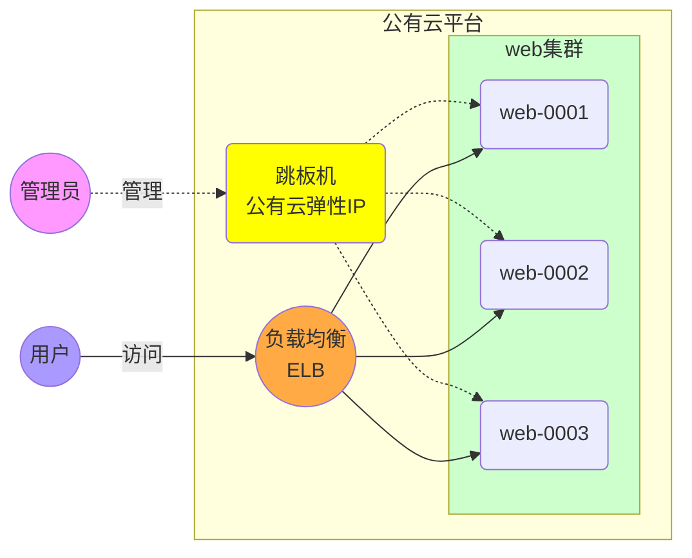

# Linux虚拟化

```mermaid
graph LR
  subgraph L1[公有云平台]
    P(跳板机<br>公有云弹性IP)
    style P fill:#ffff00
    subgraph web集群
      style web集群 fill:#ccffcc
      A1(web-0001)
      A2(web-0002)
      A3(web-0003)
    end
    P -.-> A1
    P -.-> A2
    P -.-> A3
    L((负载均衡<br>ELB))
    style L fill:#ffaa44
    L --> A1
    L --> A2
    L --> A3
  end
U1((管理员)) -.->|管理| P
U2((用户)) -->|访问| L
style U1 fill:#ff99ff
style U2 fill:#aa99ff
```

