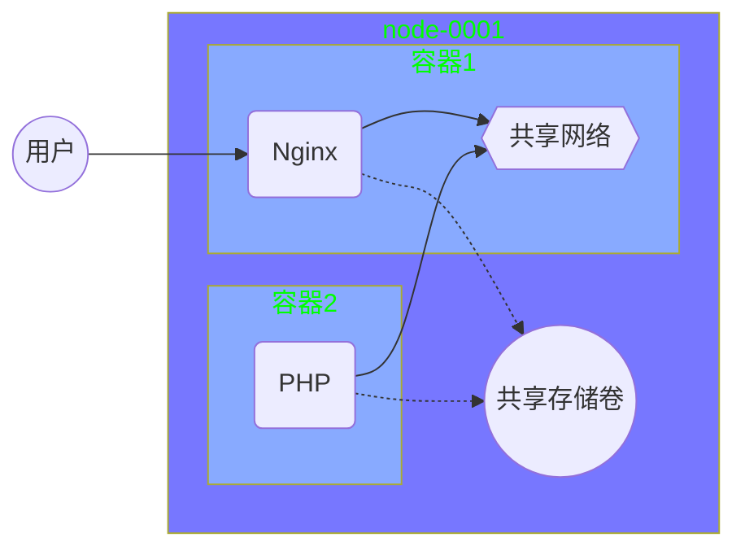
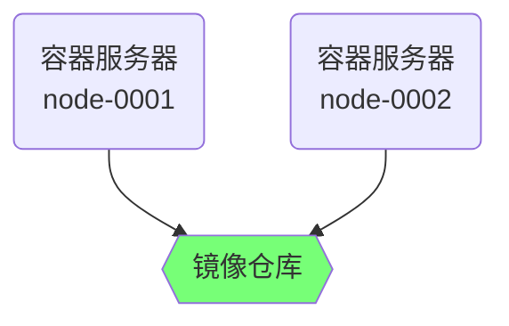

[](https://gitee.com/)

 [开源软件](https://gitee.com/explore)[企业版特惠](https://gitee.com/enterprises)[高校版](https://gitee.com/education)[博客](https://blog.gitee.com/) 

 [登录](https://gitee.com/login)[注册](https://gitee.com/signup)

[开源爱好者速进：《开源指北》邀你一起进行最终修订](https://gitee.com/gitee-community/opensource-guide/blob/master/Revision-activities.md)

[开源项目](https://gitee.com/explore) > [其他开源](https://gitee.com/explore/other-open-source) > [图书/手册/教程](https://gitee.com/explore/ebooks-manual)

 Watch [24](https://gitee.com/luckfurit/Tedu_NSD/watchers) [ Star](https://gitee.com/login)[82](https://gitee.com/luckfurit/Tedu_NSD/stargazers) [ Fork](https://gitee.com/login)[42](https://gitee.com/luckfurit/Tedu_NSD/members)

##  **[luckfurit](https://gitee.com/luckfurit) / [Tedu_NSD](https://gitee.com/luckfurit/Tedu_NSD)**

[ 代码](https://gitee.com/luckfurit/Tedu_NSD)[ Issues 0](https://gitee.com/luckfurit/Tedu_NSD/issues)[ Pull Requests 6](https://gitee.com/luckfurit/Tedu_NSD/pulls)[ Wiki 0](https://gitee.com/luckfurit/Tedu_NSD/wikis)[ 统计](https://gitee.com/luckfurit/Tedu_NSD/graph/master)

 DevOps

 

 服务

 

加入 Gitee

与超过 500 万 开发者一起发现、参与优秀开源项目，私有仓库也完全免费 ：）

[免费加入](https://gitee.com/signup?from=project-guide)

已有帐号？ [立即登录](https://gitee.com/login?from=project-guide)

master

 

 

克隆/下载 

[Tedu_NSD](https://gitee.com/luckfurit/Tedu_NSD/tree/master)

/

 **[CLOUD](https://gitee.com/luckfurit/Tedu_NSD/tree/master/CLOUD)** 

/

 **[06](https://gitee.com/luckfurit/Tedu_NSD/tree/master/CLOUD/06)** 

/

 **docker-02.md**

docker-02.md9.14 KB

[一键复制](https://gitee.com/luckfurit/Tedu_NSD/blob/master/CLOUD/06/docker-02.md#)[编辑](https://gitee.com/luckfurit/Tedu_NSD/edit/master/CLOUD/06/docker-02.md)[Web IDE](https://gitee.com/-/ide/project/luckfurit/Tedu_NSD/edit/master/-/CLOUD/06/docker-02.md)[原始数据](https://gitee.com/luckfurit/Tedu_NSD/raw/master/CLOUD/06/docker-02.md)[按行查看](https://gitee.com/luckfurit/Tedu_NSD/blame/master/CLOUD/06/docker-02.md)[历史](https://gitee.com/luckfurit/Tedu_NSD/commits/master/CLOUD/06/docker-02.md)

[luckfurit](mailto:g-jylixin@tedu.cn) 提交于 2月前 . [06 end](https://gitee.com/luckfurit/Tedu_NSD/commit/a6e9d597fc83475372a7c652053e4568101979ef)

# 容器技术 -- 2

## 镜像管理

#### commit 打包镜像

docker commit 容器id 新镜像名称:标签

```
[root@node-0001 ~]# docker run -it centos:latest
[root@02fd1719c038 ~]# rm -f /etc/yum.repos.d/*.repo
[root@02fd1719c038 ~]# curl -o /etc/yum.repos.d/CentOS-Base.repo http://mirrors.myhuaweicloud.com/repo/CentOS-Base-7.repo
[root@02fd1719c038 ~]# yum install -y net-tools vim-enhanced tree bash-completion iproute psmisc && yum clean all
[root@02fd1719c038 ~]# exit
[root@node-0001 ~]# docker commit 02fd1719c038 myos:latest
```

#### Dockerfile打包镜像

###### Dockerfile语法

| 语法指令 | 语法说明                              |
| -------- | ------------------------------------- |
| FROM     | 基础镜像                              |
| RUN      | 制作镜像时执行的命令，可以有多个      |
| ADD      | 复制文件到镜像，自动解压              |
| COPY     | 复制文件到镜像，不解压                |
| EXPOSE   | 声明开放的端口                        |
| ENV      | 设置容器启动后的环境变量              |
| WORKDIR  | 定义容器默认工作目录（等于cd）        |
| CMD      | 容器启动时执行的命令，仅可以有一条CMD |

###### 使用Dockerfile创建镜像

**docker build -t 镜像名称:标签 Dockerfile所在目录**

###### 制作apache镜像

CMD 指令可以查看 service 文件的启动命令 ExecStart（/lib/systemd/system/httpd.service）

ENV 环境变量查询服务文件中的环境变量配置文件 EnvironmentFile 指定的文件内容

```
[root@node-0001 ~]# mkdir web; cd web
[root@node-0001 web]# vim Dockerfile
FROM myos:latest
RUN  yum install -y httpd php
ENV  LANG=C
ADD  webhome.tar.gz  /var/www/html/
WORKDIR /var/www/html/
EXPOSE 80
CMD ["/usr/sbin/httpd", "-DFOREGROUND"]
# 拷贝 webhome.tar.gz 到当前目录中
[root@node-0001 web]# docker build -t myos:httpd .
```

查看与验证镜像

```
[root@node-0001 web]# docker images
REPOSITORY          TAG                 IMAGE ID            CREATED             SIZE
myos                httpd               db15034569da        12 seconds ago      412MB
myos                latest              867409e412c8        2 hours ago         281MB
[root@node-0001 web]# docker rm -f $(docker ps -aq)
[root@node-0001 web]# docker run -itd myos:httpd
[root@node-0001 web]# curl http://172.17.0.2/info.php
<pre>
Array
(
    [REMOTE_ADDR] => 172.17.0.1
    [REQUEST_METHOD] => GET
    [HTTP_USER_AGENT] => curl/7.29.0
    [REQUEST_URI] => /info.php
)
php_host: 	6c9e124bee1a
1229
```

###### 制作php-fpm镜像

```
[root@node-0001 ~]# yum install -y php-fpm
[root@node-0001 ~]# mkdir php; cd php
[root@node-0001 php]# cp /etc/php-fpm.d/www.conf ./
12:  listen = 0.0.0.0:9000
24:  ;listen.allowed_clients = 127.0.0.1
# 拷贝云盘 kubernetes/docker-images/info.php 到当前目录
[root@node-0001 php]# vim Dockerfile
FROM myos:latest
RUN  yum install -y php-fpm
COPY www.conf /etc/php-fpm.d/www.conf
EXPOSE 9000
WORKDIR /usr/local/nginx/html
COPY info.php info.php
CMD ["/usr/sbin/php-fpm", "--nodaemonize"]
[root@node-0001 php]# docker build -t myos:php-fpm .
```

###### 制作nginx镜像

```
[root@node-0001 ~]# yum install -y gcc make pcre-devel openssl-devel
[root@node-0001 ~]# useradd nginx
[root@node-0001 ~]# tar -zxvf nginx-1.12.2.tar.gz
[root@node-0001 ~]# cd nginx-1.12.2
[root@node-0001 nginx-1.12.2]# ./configure --prefix=/usr/local/nginx --user=nginx --group=nginx --with-http_ssl_module
[root@node-0001 nginx-1.12.2]# make && make install
[root@node-0001 nginx-1.12.2]# cd /usr/local/
# 拷贝云盘 kubernetes/docker-images/info.html和info.php 到 nginx/html 目录下
[root@node-0001 local]# tar czf nginx.tar.gz nginx
[root@node-0001 local]# mkdir /root/nginx ;cd /root/nginx
[root@node-0001 nginx]# cp /usr/local/nginx.tar.gz ./
[root@node-0001 nginx]# vim Dockerfile 
FROM myos:latest
RUN  yum install -y pcre openssl && useradd nginx
ADD  nginx.tar.gz /usr/local/
EXPOSE 80
WORKDIR /usr/local/nginx/html
CMD  ["/usr/local/nginx/sbin/nginx", "-g", "daemon off;"]
[root@node-0001 nginx]# docker build -t myos:nginx .
```

#### 发布容器服务

###### 对外发布服务

给他 node-0001 绑定一个公网IP

docker run -itd -p 宿主机端口:容器端口 镜像名称:标签

```
# 把 node-0001 变成 apache 服务
[root@node-0001 ~]# docker run -itd -p 80:80 myos:httpd

# 把 node-0001 变成 nginx 服务，首先必须停止 apache
[root@node-0001 ~]# docker stop $(docker ps -q)
[root@node-0001 ~]# docker run -itd -p 80:80 myos:nginx
```

验证方式： 通过浏览器访问即可

###### 容器共享卷

docker run -itd -v 宿主机对象:容器内对象 镜像名称:标签

使用共享卷动态修改容器内配置文件

```
[root@node-0001 ~]# docker run -itd --name myphp myos:php-fpm
[root@node-0001 ~]# docker inspect myphp
[root@node-0001 ~]# mkdir /var/webconf
[root@node-0001 ~]# cp /usr/local/nginx/conf/nginx.conf /var/webconf/
[root@node-0001 ~]# vim /var/webconf/nginx.conf
... ...
    fastcgi_pass   172.17.0.xx:9000;
... ...
# 映射配置文件，并启动容器
[root@localhost ~]# docker run -itd -p 80:80 \
     -v /var/webconf/nginx.conf:/usr/local/nginx/conf/nginx.conf myos:nginx
```

验证方式： 通过浏览器访问即可

###### 容器间网络通信

实验架构图例



实验步骤

```
[root@node-0001 ~]# mkdir -p /var/{webroot,webconf}
[root@node-0001 ~]# cd kubernetes/docker-images
[root@node-0001 ~]# cp info.php info.html /var/webroot/
[root@node-0001 ~]# cp /usr/local/nginx/conf/nginx.conf /var/webconf/
[root@node-0001 ~]# vim /var/webconf/nginx.conf
        location ~ \.php$ {
            root           html;
            fastcgi_pass   127.0.0.1:9000;
            fastcgi_index  index.php;
            include        fastcgi.conf;
        }
# 启动前端 nginx 服务，并映射共享目录和配置文件
[root@node-0001 ~]# docker run -itd --name nginx -p 80:80 \
      -v /var/webconf/nginx.conf:/usr/local/nginx/conf/nginx.conf \
      -v /var/webroot:/usr/local/nginx/html myos:nginx
# 启动后端 php 服务，并映射共享目录
[root@node-0001 ~]# docker run -itd --network=container:nginx \
      -v /var/webroot:/usr/local/nginx/html myos:php-fpm

# 验证服务
[root@node-0001 ~]# curl http://node-0001/info.html
<html>
  <marquee  behavior="alternate">
      <font size="12px" color=#00ff00>Hello World</font>
  </marquee>
</html>
[root@node-0001 ~]# curl http://node-0001/info.php
<pre>
Array
(
    [REMOTE_ADDR] => 172.17.0.1
    [REQUEST_METHOD] => GET
    [HTTP_USER_AGENT] => curl/7.29.0
    [REQUEST_URI] => /info.php
)
php_host: 	f705f89b45f9
1229
```

#### docker私有仓库

###### docker私有仓库图例



###### 私有仓库配置

| 主机名   | ip地址        | 最低配置    |
| -------- | ------------- | ----------- |
| registry | 192.168.1.100 | 1CPU,1G内存 |

```
[root@registry ~]# yum install -y docker-distribution
[root@registry ~]# systemctl enable --now docker-distribution
[root@registry ~]# curl http://192.168.1.100:5000/v2/_catalog
{"repositories":[]}
```

###### docker客户端配置

所有node节点都需要配置，这里 node-0001，node-0002都要配置

native.cgroupdriver cgroup驱动，docker默认 cgroupfs

registry-mirrors 默认下载仓库，使用国内源能快一点

insecure-registries 私有仓库地址（重点）

```
[root@node-0001 ~]# vim /etc/docker/daemon.json
{
    "exec-opts": ["native.cgroupdriver=systemd"],
    "registry-mirrors": ["https://hub-mirror.c.163.com"],
    "insecure-registries":["192.168.1.100:5000", "registry:5000"]
}
[root@node-0001 ~]# docker rm -f $(docker ps -aq)
[root@node-0001 ~]# systemctl restart docker
```

###### 上传镜像

```
# 上传 myos:latest, myos:httpd, myos:nginx, myos:php-fpm
[root@node-0001 ~]# docker tag myos:latest 192.168.1.100:5000/myos:latest
[root@node-0001 ~]# docker push 192.168.1.100:5000/myos:latest
```

###### 验证测试

curl [http://仓库IP:5000/v2/_catalog](http://xn--ip-xd3c833d:5000/v2/_catalog)

curl [http://仓库IP:5000/v2/镜像名称/tags/list](http://xn--ip-xd3c833d:5000/v2/镜像名称/tags/list)

```
[root@node-0002 ~]# curl http://192.168.1.100:5000/v2/_catalog
{"repositories":["myos"]}
[root@node-0002 ~]# curl http://192.168.1.100:5000/v2/myos/tags/list
{"name":"myos","tags":["latest"]}
# 使用远程镜像启动容器
[root@node-0002 ~]# docker run -it 192.168.1.100:5000/myos:latest
Unable to find image '192.168.1.100:5000/myos:latest' locally
latest: Pulling from myos
7dc0dca2b151: Pull complete 
95c297b4d705: Pull complete 
Digest: sha256:d61ffc053895e2dc16f63b8a2988dfe5f34207b48b1e74d397bb3267650ba4ce
Status: Downloaded newer image for 192.168.1.100:5000/myos:latest
[root@674ebe359e44 /]# 
```

### 评论 ( 0 )

你可以在[登录](https://gitee.com/login)后，发表评论


深圳市奥思网络科技有限公司版权所有

[关于我们](https://gitee.com/about_us)

[使用条款](https://gitee.com/terms)

[意见建议](https://gitee.com/oschina/git-osc/issues)

[合作伙伴](https://gitee.com/links.html)

 

[Git 大全](https://gitee.com/all-about-git)

[Git 命令学习](https://oschina.gitee.io/learn-git-branching/)

[代码克隆检测](https://copycat.gitee.com/)

[APP与插件下载](https://gitee.com/appclient)

 

[Gitee 封面人物](https://gitee.com/gitee-stars)

[GVP 项目](https://gitee.com/gvp)

[Gitee 博客](https://blog.gitee.com/)

[Gitee 公益计划](https://gitee.com/enterprises#nonprofit-plan)

 

[OpenAPI](https://gitee.com/api/v5/swagger)

[帮助文档](https://gitee.com/help)

[在线自助服务](https://gitee.com/self_services)

[更新日志](https://gitee.com/git-osc)

 


微信服务号

[ 官方技术交流QQ群：1050025484](https://shang.qq.com/wpa/qunwpa?idkey=df785aa7af71f7d74149ab062742d761b845464350ecba25eb440357a3e573b7)

[ git@oschina.cn](mailto: git@oschina.cn)

[ Gitee](https://www.zhihu.com/org/ma-yun-osc/)

 售前及售后使用咨询：400-606-0201

[开放原子开源基金会](https://www.openatom.org/)

认证代码托管平台

[违法和不良信息举报中心](https://12377.cn/)

[粤ICP备12009483号](http://www.beian.miit.gov.cn/)

 [简 体](https://gitee.com/language/zh-CN) / [繁 體](https://gitee.com/language/zh-TW) / [English](https://gitee.com/language/en)