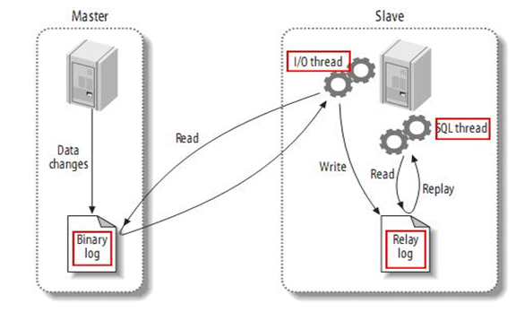
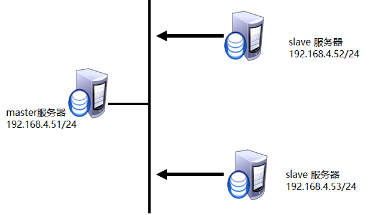
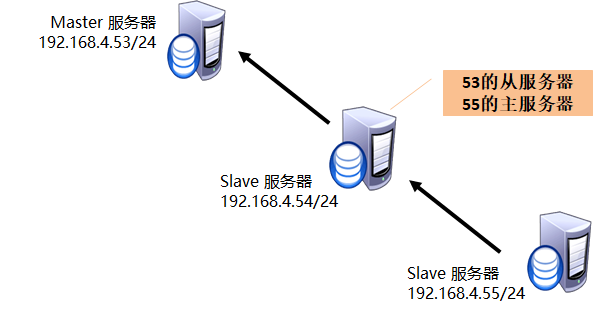

# MySQL主从同步

## 主从同步概述

- 数据存储服务结构，能够实现数据的自动同步

- 主服务器：接受客户端访问连接

- 从服务器：自动同步主服务器数据

实现 **从服务器** 自动同步 **主数据库** 的数据 ，实现数据自动备份的功能

## 主从同步原理



- Master

启用binlog日志

- Slave

Slave_IO：复制master主机 binlog日志文件里的SQL命令到本机的relay-log文件里。

Slave_SQL：执行本机relay-log文件里的SQL语句，实现与Master数据一致。

## 构建主从同步


### 构建思路

 配置主服务器

- 启用binlog日志、授权用户、查看binlog日志信息

 配置从服务器

- 设置server_id 

- 确保与主服务器数据一致。

- 指定主库信息

- 启动slave程序

- 查看状态信息

### 配置主服务器

#### **修改主配置文件**

启用binlog日志 并重启服务

```bash
[root@mysql51 mysql]# vim /etc/my.cnf
[mysqld]
log_bin=日志名  		         //启用binlog日志
server_id=id值 		         //指定服务器ID
.. ..
[root@dbsvr1 mysql]# systemctl   restart  mysqld
```

#### **授权用户**

用户权限replication slave

用户名自定义

客户端地址允许从服务器连接 

密码自定义

```bash
mysql> grant   replication  slave  on  *.*  to
              repluser@"%"  identified  by "123qqq…A";
```

#### 查看日志信息

```bash
mysql> show   master   status\G;
********************** 1. row **********************
             File: mysql51-bin.000001  	
         Position: 334  			
     Binlog_Do_DB:
 Binlog_Ignore_DB:
Executed_Gtid_Set:
.. ..
```

### 配置从服务器

#### 确保与主服务器数据一致

运行数据库服务，数据库管理正常登陆

> 在主服务器上备份数据，将备份文件拷贝给从服务器

> 从服务器使用备份文件恢复数据

> 在从服务器查看备份文件记录的binlog日志信息

```bash
]# mysqldump  -uroot  -p密码   --master-data   数据库名   > /allbak.sql
//主库备份数据，--master-data记录当前备份数据对应的日志信息
]# scp  /allbak.sql    root@192.168.4.52:/root/
//从服务器恢复数据
]# mysql  -uroot –p密码  数据库名  <  /root/allbak.sql
]# vim  /root/allbak.sql   	//查看binlog日志名及偏移量
```

#### 配置从服务器配置文件

```bash
[root@sql52 mysql]# vim /etc/my.cnf
[mysqld]
server_id=52           配置从服务器serverid

[root@sql52 mysql]# systemctl restart mysqld
```

#### 指定主服务器信息

```bash
mysql> change   master  to
    -> master_host="192.168.4.51", 		//主服务器ip地址
    -> master_user="repluser", 		//主服务器授权用户
    -> master_password="123qqq…A", 		 //授权用户密码
    -> master_log_file="mysql51-bin.000001",	//主服务器binlog日志
    -> master_log_pos=334;  			//日志偏移量
mysql> start  slave;  			//启动slave进程
```

 **1. Master信息会自动保存到`/var/lib/mysql/master.info`** **文件**

 **2.若更改主服务器信息时，应先执行`stop slave;` 修改后再执行`start slave;`**

#### 查看slave状态

`show slave status \G`   （此命令可以在任意机器上敲）

确认IO线程、SQL线程都是YES状态

#### 相关文件

存放在数据库目录下

| **文件名**              | **说明**     |
| ----------------------- | ------------ |
| master.info             | 主库信息     |
| relay-log.info          | 中继日志信息 |
| 主机名-relay-bin.xxxxxx | 中继日志     |
| 主机名-relay-bin.index  | 索引文件     |

**删除以上文件，重启数据库服务，可把主机恢复为独立的数据库服务器**


# 主从同步模式

## 主从同步结构

- 基本应用

单向复制：    主     <---      从

- 扩展应用

一主多从：    从  <---    主    --->从

​                                        ↓

​                                       从

链式复制：    主  <---   从  <---  从

互为主从：      主   <--->   主

## 配置一主多从结构



### 配置从服务器

- 配置从服务器53

  –修改配置文件

  –确保与主服务器数据一致

  –指定主库信息

  –启动slave进程

```bash
]# vim  /etc/my.cnf
    [mysqld]
    server_id=id号
:wq
]# systemctl   restart  mysqld 

mysql> change  master  to  master_host="192.168.4.51",
        -> master_user ="用户名",
        -> master_password  ="密码",
        -> master_log_file = "binlog日志文件名",  	
        -> master_log_pos = 偏移量;
mysql>  start  slave;  			//启动slave进程
mysql>  show   slave  status\G;  		//检查状态
```

## 配置主从从结构



### 配置主服务器

- 配置步骤

  –启用binlog日志

  –重启服务数据库服务

  –用户授权

```bash
]# vim  /etc/my.cnf
    [mysqld]
         log_bin=日志名
         server_id=id号
         
]# systemctl   restart  mysqld 

mysql> grant  replication  slave  on  *.*  to  用户名@"从库IP地址"      identified   by    "密码";
```

### 配置从服务器

- 配置从服务器54

  –修改配置文件

  –用户授权

  –指定主库信息

  –启动slave进程

```bash
]# vim  /etc/my.cnf
[mysqld]
server_id=id号
log-bin=日志名
log _ slave _updates 	//允许级联复制
]# systemctl   restart  mysqld 
```


```bash
mysql>  grant   replication  slave  on  *.*  to   用户名@'%'   identified  by  '密码'; 
mysql> change  master  to  master_host="192.168.4.53",
        -> master_user ="用户名",
        -> master_password  ="密码",
        -> master_log_file = "binlog日志文件名",  	
        -> master_log_pos = 偏移量;
mysql>  start  slave;  			//启动slave进程
mysql>  show   slave  status\G;  		//检查状态
```

### 配置从服务器2

- 配置从服务器55

  –修改配置文件

  –指定主库信息

  –启动slave进程

```bash
]# vim  /etc/my.cnf
    [mysqld]
         server_id=id号

]# systemctl   restart  mysqld 

mysql> change  master  to  master_host="192.168.4.54",
        -> master_user ="用户名",
        -> master_password  ="密码",
        -> master_log_file = "binlog日志文件名",  	
        -> master_log_pos = 偏移量;
mysql>  start  slave;  				//启动slave进程
mysql>  show   slave  status\G;  			//检查状态
```


### 测试配置

- 测试步骤

在主库授权访问数据的连接用户

客户端连接主库，执行与权限匹配的sql操作

授权用户连接第1台从库，可以看到主库的数据

授权用户连接第2台从库，可以看到主库的数据

```bash
mysql>   grant  all  on  库.*  to  用户@'客户端地址'  
               identified by   '密码';
]# mysql   -h数据库IP地址   -u用户名   -p密码
mysql> select   *   from   库.表;
```


## 复制模式

- 异步复制（Asynchronous replication）

主服务器执行完一次事务后，立即将结果返给客户端，不关心从服务器是否已经同步数据；

- 半同步复制（Semisynchronous replication）

介于异步复制和全同步复制之间；

主服务器在执行完一次事务后，等待至少一台从服务器同步数据完成，才将结果返回给客户端；