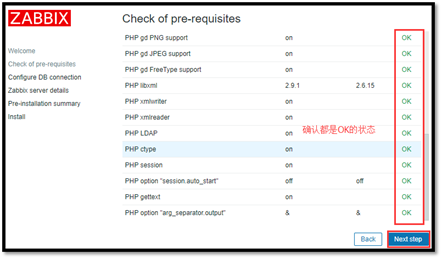
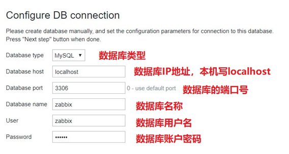
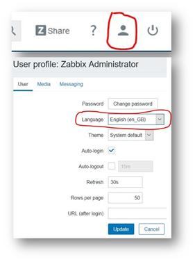
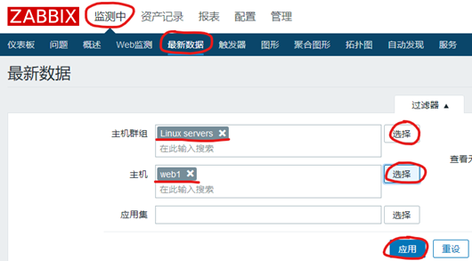
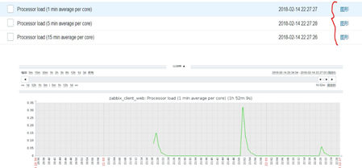
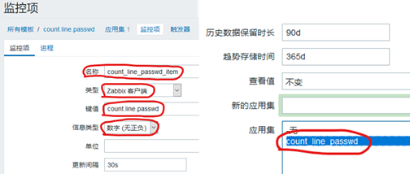
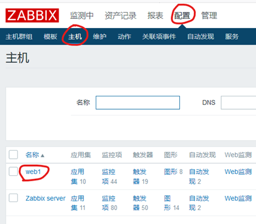
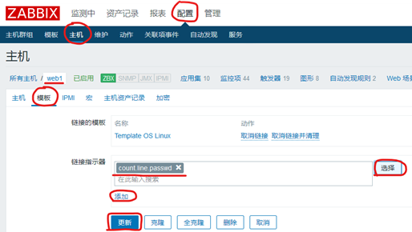
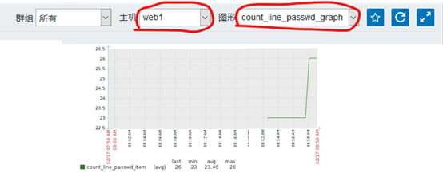

# NSD SECURITY DAY01

[TOC]

## 1 案例1：常用系统监控命令

### 1.1 问题

本案例要求熟悉查看Linux系统状态的常用命令，为进一步执行具体的监控任务做准备：

- 查看内存信息
- 查看交换分区信息
- 查看磁盘信息
- 查看CPU信息
- 查看网卡信息
- 查看端口信息
- 查看网络连接信息

### 1.2 方案

一般企业做监控的目的：实时报告系统状态，提前发现系统的问题。

监控的资源可以分为：共有数据（HTTP、FTP等）和私有数据（CPU、内存、进程数等）。

监控软件可以使用：系统自带的命令、Cacti监控系统、Nagios监控系统、Zabbix监控系统。

### 1.3 步骤

实现此案例需要按照如下步骤进行。

步骤一：使用命令查看计算机状态数据

1）查看内存与交换分区信息

```bash
[root@proxy ~]# free        #查看内存信息
total        used        free      shared  buff/cache   available
Mem:       16166888     8017696      720016      106504     7429176     7731740
Swap:       4194300      218268     3976032
[root@proxy ~]# free | awk '/Mem/{print $4}'        #查看剩余内存容量
720928
[root@proxy ~]# swapon -s        #查看交换分区信息
文件名                类型            大小        已用        权限
/dev/sda3           partition      4194300    218268    -1
```

步骤二：查看磁盘与CPU利用率

1）查看磁盘信息

```bash
[root@proxy ~]# df        #查看所有磁盘的使用率
文件系统           1K-块      已用      可用         已用% 挂载点
/dev/sda2        476254208    116879624    335159084    26%        /
/dev/sda1        198174        133897        49737        73%        /boot
[root@proxy ~]# df | awk '/\/$/{print $5}'        #查看根分区的利用率
```

2）查看CPU平均负载

```bash
[root@proxy ~]# uptime        #查看CPU负载（1，5，15分钟）
23:54:12 up 38 days, 14:54,  9 users,  load average: 0.00, 0.04, 0.05
[root@proxy ~]# uptime |awk '{print $NF}'        #仅查看CPU的15分钟平均负载
0.05
```

步骤二：查看网卡信息、端口信息、网络连接信息

1）查看网卡信息（网卡名称仅供参考），如果没有ifconfig命令则需要安装net-tools软件包。

```bash
[root@proxy ~]# ifconfig eth0
eth0: flags=4163<UP,BROADCAST,RUNNING,MULTICAST>  mtu 1500
	inet 192.168.4.5  netmask 255.255.255.0  broadcast 172.25.0.255  
    inet6 fe80::5054:ff:fe00:b  prefixlen 64  scopeid 0x20<link>   
    ether 52:54:00:00:00:0b  txqueuelen 1000  (Ethernet)   
    RX packets 62429  bytes 10612049 (10.1 MiB)     
    RX errors 0  dropped 0  overruns 0  frame 0     
    TX packets 5674  bytes 4121143 (3.9 MiB)      
    TX errors 0  dropped 0 overruns 0  carrier 0  collisions 0
[root@proxy ~]# ifconfig eth0 |awk '/inet /{print $2}'        #查看IP地址信息
192.168.4.5

[root@proxy ~]# ifconfig eth0 |awk '/RX p/{print $5}'        #网卡接受数据包流量
10625295

[root@proxy ~]# ifconfig eth0 |awk '/TX p/{print $5}'        #网卡发送数据包流量
4130821
```

2）查看端口信息

```bash
[root@proxy ~]# ss -ntulp        #查看本机监听的所有端口
#-n以数字显示端口号
#-t显示tcp连接
#-u显示udp连接
#-p显示监听端口对应的程序名称
```

3）查看网络连接信息

```bash
[root@proxy ~]# ss -antup        #查看所有的网络连接信息
#-a查看所有连接状态信息
```


## 2 案例2：部署Zabbix监控平台

### 2.1 问题

本案例要求部署一台Zabbix监控服务器，一台被监控主机，为进一步执行具体的监控任务做准备：

1. 安装LNMP环境
2. 源码安装Zabbix
3. 安装监控端主机，修改基本配置
4. 初始化Zabbix监控Web页面
5. 修改PHP配置文件，满足Zabbix需求
6. 安装被监控端主机，修改基本配置

### 2.2 方案

使用1台Linux虚拟机，安装部署LNMP环境、Zabbix及相关的依赖包，配置数据库并对Zabbix监控平台进行初始化操作。使用2台Linux被监控端，源码安装Zabbix Agent。完成Zabbix实验需要我们搭建一个实验环境，拓扑结构如表-1所示。

表-1 实验拓扑结构（网卡名称仅供参考，不能照抄）


### 2.3 步骤

实现此案例需要按照如下步骤进行。

步骤一：部署监控服务器

1）安装LNMP环境

Zabbix监控管理控制台需要通过Web页面展示出来，并且还需要使用MySQL来存储数据，因此需要先为Zabbix准备基础LNMP环境。

```bash
[root@zabbixserver ~]# yum -y install gcc pcre-devel  openssl-devel
[root@zabbixserver ~]# tar -xf nginx-1.12.2.tar.gz
[root@zabbixserver ~]# cd nginx-1.12.2
[root@zabbixserver nginx-1.12.2]# ./configure --with-http_ssl_module
[root@zabbixserver nginx-1.12.2]# make && make install
[root@zabbixserver ~]# yum -y  install  php  php-mysql  php-fpm
[root@zabbixserver ~]# yum -y  install  mariadb  mariadb-devel  mariadb-server
```

2）修改Nginx配置文件

配置Nginx支持PHP动态网站，因为有大量PHP脚本需要执行，因此还需要开启Nginx的各种fastcgi缓存，加速PHP脚本的执行速度。

```bash
[root@zabbixserver ~]# vim /usr/local/nginx/conf/nginx.conf
… …
http{
… …   
	   fastcgi_buffers 8 16k;                  #缓存php生成的页面内容，8个16k  
       fastcgi_buffer_size 32k;              #缓存php生产的头部信息，32k    
       fastcgi_connect_timeout 300;         #连接PHP的超时时间，300秒    
	   fastcgi_send_timeout 300;             #发送请求的超时时间，300秒  
       fastcgi_read_timeout 300;            #读取请求的超时时间，300秒
location ~ \.php$ {       
					root           html;       
                    fastcgi_pass   127.0.0.1:9000;       
                    fastcgi_index  index.php;           
                    include        fastcgi.conf;    
            }
… …
```

3）启动服务

启动Nginx、PHP-FPM、MariaDB服务，关闭SELinux与防火墙。

```bash
[root@zabbixserver ~]# systemctl start  mariadb        #启动服务
[root@zabbixserver ~]# systemctl start  php-fpm        #启动服务
[root@zabbixserver ~]# systemctl enable  mariadb        #设置开机自启
[root@zabbixserver ~]# systemctl enable  php-fpm        #设置开机自启
[root@zabbixserver ~]# /usr/local/nginx/sbin/nginx        #启动服务
[root@zabbixserver ~]# echo /usr/local/nginx/sbin/nginx  >> /etc/rc.local
[root@zabbixserver ~]# chmod +x /etc/rc.local
#通过rc.local设置开机自启
[root@zabbixserver ~]# firewall-cmd --set-default-zone=trusted
[root@zabbixserver ~]# setenforce 0
[root@zabbixserver ~]# sed -i '/SELINUX/s/enforcing/permissive/' /etc/selinux/config
```

步骤二：部署监控服务器Zabbix Server

1）源码安装Zabbix Server

多数源码包都是需要依赖包的，zabbix也一样，源码编译前需要先安装相关依赖包。

```bash
[root@zabbixserver lnmp_soft]# yum -y install  net-snmp-devel curl-devel autoconf libevent-devel
#安装相关依赖包
[root@zabbixserver lnmp_soft]# tar -xf zabbix-3.4.4.tar.gz
[root@zabbixserver lnmp_soft]# cd zabbix-3.4.4/
[root@zabbixserver zabbix-3.4.4]# ./configure  --enable-server --enable-proxy --enable-agent --with-mysql=/usr/bin/mysql_config  --with-net-snmp --with-libcurl
# --enable-server安装部署zabbix服务器端软件
# --enable-agent安装部署zabbix被监控端软件
# --enable-proxy安装部署zabbix代理相关软件
# --with-mysql指定mysql_config路径
# --with-net-snmp允许zabbix通过snmp协议监控其他设备（如交换机、路由器等）
# --with-libcurl安装相关curl库文件，这样zabbix就可以通过curl连接http等服务，测试被监控主机服务的状态
[root@zabbixserver zabbix-3.4.4]# make && make install
```

2）创建并初始化数据库

```bash
[root@zabbixserver ~]# mysql
mysql> create database zabbix character set utf8;
#创建数据库，数据库名称为zabbix，character set utf8是支持中文字符集
mysql> grant all on zabbix.* to zabbix@'localhost' identified by 'zabbix';
#创建可以访问数据库的账户与密码，用户名是zabbix，密码是zabbix
[root@zabbixserver ~]# cd lnmp_soft/zabbix-3.4.4/database/mysql/
[root@zabbixserver mysql]# mysql -uzabbix -pzabbix zabbix < schema.sql
[root@zabbixserver mysql]# mysql -uzabbix -pzabbix zabbix < images.sql
[root@zabbixserver mysql]# mysql -uzabbix -pzabbix zabbix < data.sql
#刚刚创建是空数据库，zabbix源码包目录下，有提前准备好的数据
#使用mysql导入这些数据即可（注意导入顺序）
#-u指定数据库用户名，-p指定数据库密码

如何测试？
[root@zabbixserver ~]# mysql -uzabbix -pzabbix -h localhost zabbix
#-u指定用户名，-p指定密码，-h指定服务器IP，最后的zabbix是数据库名称
#使用zabbix账户（密码为zabbix）连接localhost服务器上面的zabbix数据库
```

3）修改zabbix_server配置并启动监控服务

修改Zabbix_server配置文件，设置数据库相关参数，启动Zabbix_server服务

```bash
[root@zabbixserver ~]# vim /usr/local/etc/zabbix_server.conf
DBHost=localhost
# 85行，定义哪台主机为数据库主机，localhost为本机
DBName=zabbix
#95行，设置数据库名称
DBUser=zabbix
#111行，设置数据库账户
DBPassword=zabbix
#119行，设置数据库密码
LogFile=/tmp/zabbix_server.log    
#38行，日志的位置，排错使用，该行仅查看即可

[root@zabbixserver ~]# useradd -s /sbin/nologin zabbix
#服务不允许以root身份启动，不创建用户无法启动服务（用户不需要登录系统）
#创建zabbix用户才可以以zabbix用户的身份启动服务
#启动服务后可以通过ps aux查看进程是以什么用户的身份启动的
[root@zabbixserver ~]# zabbix_server      
#启动服务（不推荐这么启动服务，推荐使用systemctl启动服务，下面有service文件模板）
[root@zabbixserver ~]# echo  zabbix_server >>  /etc/rc.local        #设置开机自启 
[root@zabbixserver ~]# chmod +x  /etc/rc.local
[root@zabbixserver ~]# ss -ntulp |grep zabbix_server     #确认连接状态，端口10051
tcp LISTEN 0 128 *:10051 *:* users:(("zabbix_server",pid=23275,fd=4),("zabbix_server",pid=23274,fd=4)
```

提示：如果是因为配置文件不对，导致服务无法启动时，不要重复执行zabbix_server，

一定要先使用killall zabbix_server关闭服务后，再重新启动一次。

安装psmisc软件包，才有killall命令。

附加知识（非必须操作）：也可以通过创建service文件管理zabbix服务。

```bash
[root@zabbixserver ~]# cd /usr/lib/systemd/system/
[root@zabbixserver ~]# vim zabbix_server.service 
[Unit]
Description=zabbix server
After=network.target remote-fs.target nss-lookup.target
[Service]
Type=forking
PIDFile=/tmp/zabbix_server.pid
ExecStart=/usr/local/sbin/zabbix_server
ExecStop=/bin/kill $MAINPID
[Install]
WantedBy=multi-user.target
```

4) 修改Zabbix_agent配置文件，启动Zabbix_agent服务

```bash
[root@zabbixserver ~]# vim /usr/local/etc/zabbix_agentd.conf
Server=127.0.0.1,192.168.2.5            #93行，允许哪些主机监控本机
ServerActive=127.0.0.1,192.168.2.5      #134行，允许哪些主机通过主动模式监控本机
Hostname=zabbix_server                  #145行，设置本机主机名（名称可以任意）
LogFile=/tmp/zabbix_agentd.log          #设置日志文件（不需要修改）
UnsafeUserParameters=1                  #280行，是否允许自定义监控传参
[root@zabbixserver ~]# zabbix_agentd    
#启动监控agent（不推荐这么启动服务，推荐使用systemctl启动服务，下面有service文件模板）

[root@zabbixserver ~]# echo zabbix_agentd  >> /etc/rc.local    #设置开机自启

[root@zabbixserver ~]# ss -ntulp |grep zabbix_agentd   #查看端口信息为10050
tcp    LISTEN     0      128       *:10050                 *:*                   users:(("zabbix_agentd",pid=23505,fd=4),("zabbix_agentd",pid=23504,fd=4)
```

提示：如果是因为配置文件不对，导致服务无法启动时，不要重复执行zabbix_agentd，

一定要先使用killall zabbix_agentd关闭服务后，再重新启动一次。

安装psmisc软件包，才有killall命令。

附加知识：编写zabbix_agentd的service文件，通过systemd管理服务。

```bash
# vim /usr/lib/systemd/system/zabbix_agentd.service
[Unit]
Description=zabbix agent
After=network.target remote-fs.target  nss-lookup.target
[Service]
Type=forking
PIDFile=/tmp/zabbix_agentd.pid
ExecStart=/usr/local/sbin/zabbix_agentd
ExecStop=/bin/kill $MAINPID
[Install]
WantedBy=multi-user.target
```

5)上线Zabbix的Web页面

```bash
[root@zabbixserver ~]# cd lnmp_soft/zabbix-3.4.4/frontends/php/
[root@zabbixserver php]# cp -r * /usr/local/nginx/html/
[root@zabbixserver php]# chown -R  apache.apache /usr/local/nginx/html/
```

浏览器访问Zabbix_server服务器的Web页面

```bash
火狐浏览器访问【 firefox http://192.168.2.5/index.php 】
#第一次访问，初始化PHP页面会检查计算机环境是否满足要求，如果不满足会给出修改建议
#默认会提示PHP的配置不满足环境要求，需要修改PHP配置文件
```

根据错误提示，安装依赖、修改PHP配置文件，满足Zabbix_server的环境要求。

```bash
[root@zabbixserver ~]# yum -y install  php-gd  php-xml
[root@zabbixserver ~]# yum -y install  php-bcmath  php-mbstring
[root@zabbixserver ~]# vim /etc/php.ini
date.timezone = Asia/Shanghai             #878行，设置时区
max_execution_time = 300                  #384行，最大执行时间，秒
post_max_size = 32M                       #672行，POST数据最大容量
max_input_time = 300                      #394行，服务器接收数据的时间限制
[root@zabbixserver ~]# systemctl restart php-fpm
```

修改完PHP配置文件后，再次使用浏览器访问服务器，则会提示如图-1和图-2所示的提示信息。


图-1



图-2

注意：这里有一个PHP LDAP是warning状态是没有问题的！

在初始化数据库页面，填写数据库相关参数，如图-3所示。



图-3

在登陆页面，使用用户(admin)和密码(zabbix)登陆，登陆后设置语言环境为中文，如图-4和图-5所示。


图-4



图-5

步骤三：部署被监控主机Zabbix Agent

1）源码安装Zabbix agent软件

在2.100和2.200做相同操作（以web1为例）。

```bash
[root@web1 ~]# useradd -s /sbin/nologin  zabbix
[root@web1 ~]# yum -y install gcc pcre-devel autoconf
[root@web1 ~]# tar -xf zabbix-3.4.4.tar.gz 
[root@web1 ~]# cd zabbix-3.4.4/
[root@web1 zabbix-3.4.4]# ./configure --enable-agent
[root@web1 zabbix-3.4.4]# make && make install 
```

2）修改agent配置文件，启动Agent

```bash
[root@web1 ~]# vim /usr/local/etc/zabbix_agentd.conf
Server=127.0.0.1,192.168.2.5                #93行，谁可以监控本机（被动监控模式）
ServerActive=127.0.0.1,192.168.2.5          #134行，谁可以监控本机（主动监控模式）
Hostname=web1                               #145行，被监控端自己的主机名
EnableRemoteCommands=1           #69行，监控异常后，是否允许服务器远程过来执行命令，如重启某个服务
UnsafeUserParameters=1                    #280行，是否允许自定义key传参
[root@web1 ~]# zabbix_agentd             
#启动agent服务（不推荐这么启动服务，推荐使用systemctl启动服务，上面有service文件模板）
[root@web1 ~]# echo zabbix_agentd  >> /etc/rc.local
[root@web1 ~]# chmod +x  /etc/rc.local

[root@web1 ~]# firewall-cmd --set-default-zone=trusted
[root@web1 ~]# sed -i  '/SELINUX/s/enforcing/permissive/' /etc/selinux/config
[root@web1 ~]# setenforce 0
```


## 3 案例3：配置及使用Zabbix监控系统

### 3.1 问题

沿用练习一，使用Zabbix监控平台监控Linux服务器，实现以下目标：

1. 监控CPU
2. 监控内存
3. 监控进程
4. 监控网络流量
5. 监控硬盘

### 3.2 方案

通过Zabbix监控平台，添加被监控web1主机（192.168.2.100）并链接监控模板即可，Zabbix默认模板就可以监控CPU、内存、进程、网络、磁盘等项目。

### 3.3 步骤

实现此案例需要按照如下步骤进行。

步骤一：添加监控主机

主机是Zabbix监控的基础，Zabbix所有监控都是基于Host主机。

使用火狐浏览器登录http://192.168.2.5/index.php，通过Configuration（配置）-->Hosts（主机）-->Create Host（创建主机）添加被监控Linux主机，如图-7所示。


图-7

添加被监控主机时，需要根据提示输入被监控Linux主机的主机名称（最好与电脑的主机名一致，但也允许不一致）、主机组、IP地址等参数，具体参考图-8所示。


图-8

步骤二：为被监控主机添加监控模板

Zabbix通过监控模板来对监控对象实施具体的监控功能，根据模板来定义需要监控哪些数据，对于Linux服务器的监控，Zabbix已经内置了相关的模板（Template OS Linux），选择模板并链接到主机即可，如图-9所示。


图-9

步骤三：查看监控数据

查看监控数据，登录Zabbix Web控制台，点击Monitoring(监控中)—> Latest data(最新数据)，正过滤器中填写过滤条件，根据监控组和监控主机选择需要查看哪些监控数据，如图-10所示。



图-10

找到需要监控的数据后，可以点击后面的Graph（图形）查看监控图形，如图-11所示。



图-11


## 4 案例4：自定义Zabbix监控项目

### 4.1 问题

沿用练习二，使用Zabbix实现自定义监控，实现以下目标：

1. 监控Linux服务器系统账户的数量

### 4.2 方案

需要使用Zabbix自定义key的方式实现自定义监控，参考如下操作步骤：

1. 创建自定义key
2. 创建监控项目
3. 创建监控图形
4. 将监控模板关联到主机

### 4.3 步骤

实现此案例需要按照如下步骤进行。

步骤一：被监控主机创建自定义key（在192.168.2.100操作）

1）创建自定义key

自定义key语法格式为：UserParameter=自定义key名称,命令。

自定义的key文件一般存储在/usr/local/etc/zabbix_agentd.conf.d/目录，这里还需要修改zabbix_agentd.conf文件，允许自定义监控key，来读取该目录下的所有文件 。

```bash
[root@web1 ~]# vim /usr/local/etc/zabbix_agentd.conf
Include=/usr/local/etc/zabbix_agentd.conf.d/             #264行，加载配置文件目录
[root@web1 ~]# cd /usr/local/etc/zabbix_agentd.conf.d/
[root@web1 zabbix_agentd.conf.d]# vim count.line.passwd
UserParameter=count.line.passwd,sed -n '$=' /etc/passwd
#自定义key语法格式:
#UserParameter=自定义key名称,命令
```

2）测试自定义key是否正常工作

```bash
[root@web1 ~]# killall  zabbix_agentd
[root@web1 ~]# zabbix_agentd                                #重启agent服务
[root@web1 ~]# zabbix_get -s 127.0.0.1 -k count.line.passwd
21
```

注意：如zabbix_get命令执行错误，提示Check access restrictions in Zabbix agent configuration，则需要检查agent配置文件是否正确：

```bash
[root@web1 ~]# vim /usr/local/etc/zabbix_agentd.conf
Server=127.0.0.1,192.168.2.5
ServerActive=127.0.0.1,192.168.2.5
```

步骤二：创建监控模板

模板、应用集与监控项目的关系图，参考图-12所示


图-12

1）添加监控模板

登录Zabbix Web监控控制台，通过Configuration(配置)-->Template(模板)-->Create template(创建模板)，填写模板名称，新建模板群组，如图-13所示。


图-13

创建模板后，默认模板中没有任何应用集、监控项、触发器、图形等，如图-14所示。


图-14

2）创建应用集

创建完成模板后，默认模板中没有任何应用集、监控项、触发器、图形等资源。这里需要点击模板后面的Application（应用集）链接打开创建应用集的页面，如图-15所示。


图-15

点击Application（应用集）后，会刷新出图-16所示页面，在该页面中点击Create application（创建应用集）按钮。


图-16

设置应用集名称，名称可以任意，如图-17所示。


图-17

3）创建监控项目item（监控项）

与创建应用集一样，在模板中还需要创建监控项目，如图-18所示，点击items（监控项），并在刷新出的新页面中选择Create items（创建监控项）创建项目，如图-19所示。


图-18


图-19

接下来，还需要给项目设置名称（名称可以任意）及对应的自定义key（必须与前面自定义的监控key名称一致），如图-20所示。



图-20

4）创建图形

为了后期可以通过图形的方式展示监控数据，还需要在模板中创建图形，设置方法与前面的步骤一致，在监控模板后面点击Graph（图形）即可创建图形，设置监控图形基于什么监控数据，如图-21所示。


图-21

5）将模板链接到被监控主机

将完整的监控模板制作完成后，就可以将模板链接到主机实现监控功能了。首先找到被监控主机Configuration（配置）-->Hosts（主机），如图-22所示。



图-22

点击需要的被监控主机链接，打开监控主机设置页面，在Template（模板）页面中选择需要链接到该主机的模板，在此选择刚刚创建的模板count_line.passwd添加即可，如图-23所示。



图-23

6）查看监控数据图形

点击Monitoring（监控中）-->Craphs（图形），根据需要选择条件，查看监控图形，如图-24和图-25所示。




图-25

附加思维导图，如图-26所示：


图-26