# NSD Project1 DAY01

[TOC]

## 1 案例1：服务器硬件

### 1.1 问题

服务器硬件品牌有哪些，服务器硬件组成结构分析：

- 常见服务器品牌介绍
- 服务器硬件组成
- 配置服务器硬件RAID
- Dell服务器iDRAC远程管理配置

### 1.2 方案

参考视频：http://www.tmooc.cn/course/300254.shtml。

常见服务器品牌包括：IBM服务器、Dell服务器、HP服务器、浪潮服务器、华为服务器。

与普通电脑一样，服务器也是由主板、内存、CPU、磁盘、网卡、显卡、电源、主机箱等硬件设备组成。

服务器分为塔式服务器、机架式服务器、刀片服务器。

RAID是Redundant Arrays of Independent Drives（独立冗余磁盘阵列）的简称，RAID分为很多级别，常用级别有RAID0、RAID1、RAID5、RAID6、RAID10、RAID01。

### 1.3 步骤

实现此案例需要按照如下步骤进行。

步骤一：常见服务器品牌

1）Dell服务器是目前IDC机房中普遍采用的服务器品牌。

Dell入门级塔式服务器PowerEdge T340，如图-1所示，该服务器的目标应用是文件/打印，协作/共享，邮件/讯息，备份/恢复，视频监控等。


图-1 PowerEdge T340服务器

产品配置如下：

- 4核和6核英特尔至强E-2100处理器
- 4个DIMM插槽(高达64GB的内存容量)
- 8个3.5英寸热插拔HDD硬盘
- 4个PCIe 3.0插槽
- 2个1GbE
- 单个或冗余的双495W电源或者单个350W有线电源

Dell高性能塔式服务器PowerEdge T640，如图-2所示。


图-2 PowerEdge T640服务器

产品配置如下：

- 双路英特尔至强CPU，每个处理器支持28个内核
- 24个DIMM内存插槽，最高支持192GB内存，仅支持ECC DDR4
- 电源750W、1100W、1600W、2000W、2400W

Dell入门级单路机架式服务器PowerEdge R330（1U=44.45mm=4.45cm），如图-3所示。

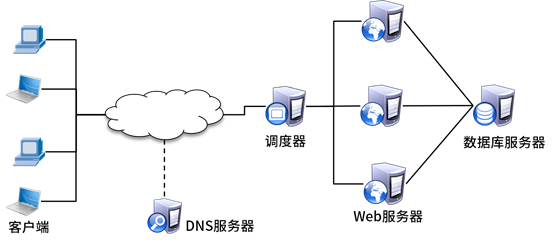

图-3 PowerEdge R330机架式服务器

产品配置如下：

- 1路CPU，英特尔至强、英特尔奔腾、英特尔酷睿CPU
- 4个DIMM，最高支持64GB内存
- 2.5或3.5寸硬盘，STATA或SAS接口
- 双电源

Dell机架式服务器PowerEdge R740（2u=88.9mm=8.89cm），如图-4所示。


图-4 PowerEdge R740服务器

产品配置如下：

- 双路CPU，每个CPU支持28个核心
- 24个DIMM内存插槽，最高192GB，ECC DDR4
- 双电源

2）IBM服务器

IBM机架式服务器X3250M6（1U），如图-5所示。


图-5 IBM X3250M6服务器

产品配置如下：

- 1路CPU，英特尔至强处理器
- 4个DIMM内存插槽，最大64G内存
- 4个3.5寸磁盘位，默认无硬盘，最大可配24TB
- 支持RAID 0，1，5
- 一个300W固定电源

3）HP服务器

HPE ProLiant DL380 Gen10 服务器（2U），如图-6所示。


图-6 HPE ProLiant DL380 Gen10 服务器

产品配置如下：

- 2路CPU，英特尔至强
- 24个DIMM插槽，支持最大3T DDR4内存
- 24个磁盘接口
- iLO远程管理
- 4个网卡接口

步骤二：服务器硬件组成

1）CPU

英特尔：酷睿八代（i3,i5,i7,i9），酷睿九代(i3,i5,i7,i9)，酷睿十代

至强E（标准版），至强W（高功耗版）

奔腾处理器

AMD： 家用版（锐龙、速龙）

服务器版本（皓龙、霄龙）

2) 内存

常见品牌：金士顿、三星

家用普通内存不具有数据校验功能

服务器配置带ECC数据校验功能的内存条

规格：DDR1、DDR2、DDR3、DDR4、DDR5

3）硬盘

常见品牌：三星、英特尔、希捷、西部数据

家用磁盘接口：SATA

服务器磁盘接口：SAS

SSD固态硬盘

大小：2.5寸、3.5寸

4）远程管理设备

Dell： iDRAC

HP： iLO

IBM： Tivoli/ˈtɪvəli/

步骤三：配置服务器硬件RAID

1）RAID5

服务器开机后根据提示快速按Ctrl+R组合键即可进入RAID配置界面，如图-7所示。

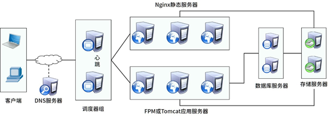

图-7

进入RAID配置界面可以看到所有未配置的磁盘列表，主菜单包含：VD Mgmt、PD Mgmt、Ctrl Mgmt、Properties，如图-8所示。


图-8

Ctrl+N进入下一页菜单，Ctrl+P进入上一页菜单，通过F2可以进入配置菜单，如图-9所示。


图-9

正式配置RAID之前可以使用Clear Config清空所有配置，然后选择Create New VD创建新的RADID磁盘阵列，如图-10所示。


图-10

在RAID Level中选择RAID级别，如RAID5（最少需要三块磁盘），并在右侧Physical Disks中选择使用哪些物理磁盘组合RAID，如图-11所示。


图-11

点击OK确定后，可以在主菜单中看到刚刚创建的磁盘阵列，按F2选择Properties可以配置该磁盘阵列的高级属性，如图-12所示。

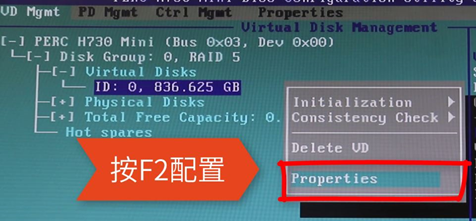

图-12

点击Advanced高级，如图-13所示。


图-13

在高级属性中开启磁盘缓存，默认未unchanged，需要设置为enable，并可以设置缓存策略：Write Through直写和Write Back回写，write through模式时数据同时被写入缓存和磁盘，安全，但是写入速度慢，write back模式时数据先写入缓存，再写入磁盘，写入速度快，但数据写入缓存时突发断电会导致数据丢失。配置菜单如图-14所示。

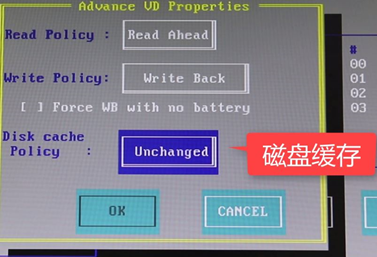

图-14

创建完RADID后还需要初始化磁盘，菜单如图-15所示。


图-15

2）RAID故障恢复

将损坏的磁盘拔掉，替换一块新的磁盘即可，注意需要将新磁盘插入损坏的磁盘相同接口。磁盘大小、品牌尽可能一致。恢复数据时界面会提示Rebuild，效果如图-16所示。


图-16

3）配置Hot Spare磁盘

热备磁盘是提前准备一块备用的磁盘（当前并不使用），当RAID磁盘阵列出现损坏后，系统自动使用该热备磁盘，替代损坏的磁盘，从而不需要人工插拔磁盘即可自动修复。

创建新的RAID磁盘阵列时，不要使用完所有磁盘，留一块磁盘做热备磁盘，点击Advanced高级选项即可配置热备磁盘，如图-17所示。


图-17

勾选Configure Hot Spare配置热备磁盘，如图-18所示。

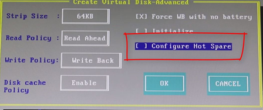

图-18

在弹出的对话框中勾选需要的热备磁盘即可完成配置，如图-19所示。


图-19

4）其他级别的磁盘阵列

其他级别的磁盘阵列配置方式类似，可以根据自己的需要进行配置如RAID10，RAID6等，但是都需要磁盘阵列卡支持才可以配置。

步骤四：Dell服务器iDRAC远程管理配置

1）配置端口重定向

iDRAC（Integrated Dell Remote Access Controller），是戴尔服务器集成的远程控制卡。

iDRAC需要授权使用，有授权的情况下可以直接通过浏览器访问：http://服务器IP，远程管理服务器，没有授权的情况下可以通过端口重定向将服务器上的显示内容重定向到远程管理端的电脑上（一般是用自己的笔记本远程服务器），这种方式不需要授权。

开启服务器后根据提示快速按F2键进入BIOS界面，如图-20所示。


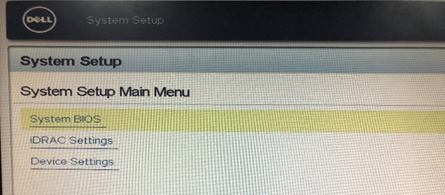

图-20

进入BIOS Settings后，选择Serial Communication菜单，如图-21所示。


图-21

将控制台重定向到com2，设置Serial Device=com1，Serial Device=com2，效果如图-22所示。


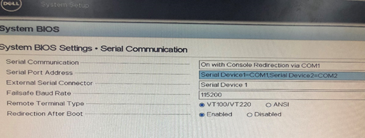

图-22

2）初始化清空iDRAC设置

进入iDRAC Setting界面选择Rest iDRAC configuration to defaults，如图-23所示。


图-23

3）配置iDRAC网络

进入iDRAC Setting界面选择network，如图-24所示。


图-24

选择网卡并配置IP地址，如图-25和图-26所示，网段需要根据实际情况自行配置。

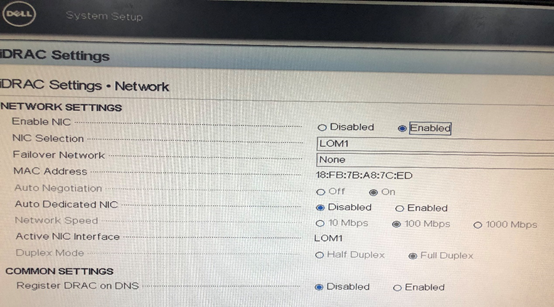

图-25


图-26

开启IPMI智能平台管理接口（配置后可以通过命令行管理服务器），客户端安装ipmitool软件包，如图-27所示。


图-27

4）配置远程管理账户

进入iDRAC Setting界面选择User Configuration，如图-28所示。

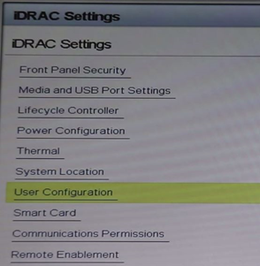

图-28

配置账户名称root，并设置密码，如图-29所示。

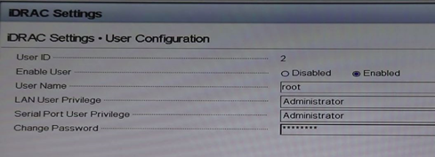

图-29

5）远程管理端主机配置，安装ipmitool软件包

```
[root@centos7 ~]# yum -y install ipmitool
```

常用命令操作列表如下。

```
[root@centos7 ~]# ipmitool -I lanplus -U root -H 服务器IP  power status
#查看服务器电源状态
[root@centos7 ~]# ipmitool -I lanplus -U root -H 服务器IP  power on
#开启服务器电源
[root@centos7 ~]# ipmitool -I lanplus -U root -H 服务器IP  power off
#关闭服务器电源
[root@centos7 ~]# ipmitool -I lanplus -U root -H 服务器IP  power reset
#重启服务器电源
[root@centos7 ~]# ipmitool -I lanplus -U root -H 服务器IP  sol activate
#远程管理
```


## 2 案例2：部署LNMP动态网站

### 2.1 问题

部署LNMP动态网站，实现以下目标：

1. 安装LNMP平台相关软件
2. 配置Nginx实现动静分离
3. 配置数据库，创建账户与密码
4. 上线Wordpress代码
5. 使用Wordpress后台管理界面，调整Wordpress版式

### 2.2 方案

实验拓扑如图-30所示，做具体实验前请先配置好环境。


图-30

### 2.3 步骤

实现此案例需要按照如下步骤进行。

步骤一：安装部署LNMP软件

备注：mariadb（数据库客户端软件）、mariadb-server（数据库服务器软件）、mariadb-devel（其他客户端软件的依赖包）、php（解释器）、php-fpm（进程管理器服务）、php-mysql（PHP的数据库扩展包）。

1）安装软件包

```bash
[root@centos7 ~]# yum -y install gcc openssl-devel pcre-devel   #安装依赖包
[root@centos7 ~]# tar -xf nginx-1.12.2.tar.gz
[root@centos7 ~]# cd nginx-1.12.2
[root@centos7 nginx-1.12.2]# ./configure   \
--with-http_ssl_module   \
--with-http_stub_status_module
[root@centos7 nginx-1.12.2]# make && make install

[root@centos7 ~]# yum -y install   mariadb   mariadb-server   mariadb-devel
[root@centos7 ~]# yum -y install   php        php-mysql        php-fpm
```

2)启动服务(nginx、mariadb、php-fpm)

```bash
[root@centos7 ~]# /usr/local/nginx/sbin/nginx 			#启动Nginx服务
[root@centos7 ~]# echo "/usr/local/nginx/sbin/nginx" >> /etc/rc.local
[root@centos7 ~]# chmod +x /etc/rc.local
[root@centos7 ~]# ss -utnlp | grep :80					#查看端口信息

[root@centos7 ~]# systemctl start   mariadb           	#启动mariadb服务器
[root@centos7 ~]# systemctl enable  mariadb				#设置开机自启           	
[root@centos7 ~]# systemctl start  php-fpm           	#启动php-fpm服务
[root@centos7 ~]# systemctl enable php-fpm				#设置开机自启
```

备注：设置防火墙与SELinux.

```bash
[root@centos7 ~]# firewall-cmd --set-default-zone=trusted
[root@centos7 ~]# setenforce  0
[root@centos7 ~]# sed -i  '/SELINUX/s/enforcing/permissive/'  /etc/selinux/config
```

附加知识：systemd！！！

源码安装的软件默认无法使用systemd管理，如果需要使用systemd管理源码安装的软件需要手动编写服务的service文件（编写是可以参考其他服务的模板文件）。以下是nginx服务最终编辑好的模板。

Service文件存储路径为/usr/lib/systemd/system/目录。

```bash
[root@centos7 ~]# vim /usr/lib/systemd/system/nginx.service
[Unit]
Description=The Nginx HTTP Server
#描述信息
After=network.target remote-fs.target nss-lookup.target
#指定启动nginx之前需要其他的其他服务，如network.target等

[Service]
Type=forking
#Type为服务的类型，仅启动一个主进程的服务为simple，需要启动若干子进程的服务为forking
ExecStart=/usr/local/nginx/sbin/nginx
#设置执行systemctl start nginx后需要启动的具体命令.
ExecReload=/usr/local/nginx/sbin/nginx -s reload
#设置执行systemctl reload nginx后需要执行的具体命令.
ExecStop=/bin/kill -s QUIT ${MAINPID}
#设置执行systemctl stop nginx后需要执行的具体命令.

[Install]
WantedBy=multi-user.target
```

3）修改Nginx配置文件，实现动静分离

修改配置文件，通过两个location实现动静分离，一个location匹配动态页面，一个loation匹配其他所有页面。

注意修改默认首页为index.php!！！！

```bash
[root@centos7 ~]# vim /usr/local/nginx/conf/nginx.conf 
...省略部分配置文件内容...
location / {
            root   html;
            index  index.php index.html index.htm;
        }
...省略部分配置文件内容...
location ~ \.php$ {
            root           html;
            fastcgi_pass   127.0.0.1:9000;
            fastcgi_index  index.php;
            include        fastcgi.conf;
        }
...省略部分配置文件内容...
[root@centos7 ~]# /usr/local/nginx/sbin/nginx -s reload			#重新加载配置
```

4）配置数据库账户与权限

为网站提前创建一个数据库、添加账户并设置该账户有数据库访问权限。

```bash
[root@centos7 ~]# mysql
MariaDB [(none)]> create database wordpress character set utf8mb4;
#创建数据库，数据库名称为wordpress，该数据库支持中文（character set utf8mb4）
MariaDB [(none)]> grant all on wordpress.* to wordpress@'localhost' identified by 'wordpress';
#语法格式：grant 权限 on 数据库名.表名  to 用户名@客户端主机 identified by 密码
#创建用户并授权，用户名为wordpress，该用户对wordpress数据库下的所有表有所有权限
#wordpress用户的密码是wordpress，授权该用户可以从localhost主机登录数据库服务器
#all代表所有权限（wordpress用户可以对wordpress数据库中所有表有所有权限）
#wordpress.*代表wordpress数据库中的所有表
MariaDB [(none)]> grant all on wordpress.* to wordpress@'192.168.2.11' identified by 'wordpress';
MariaDB [(none)]> flush privileges;
#刷新权限
MariaDB [(none)]> exit
#退出数据库

如何验证？
看看是否可以使用新创建的账户登录数据库服务器：
[root@centos7 ~]# mysql -uwordpress -pwordpress -h 192.168.2.11 wordpress
#-u指定数据库账户名称，-p指定数据库账户的密码，-h指定需要远程数据库的IP地址
#最后的wordpress为数据库的名称
```

步骤二：上线wordpress代码

1）上线PHP动态网站代码（wordpress.zip在lnmp_soft目录中）

```bash
[root@centos7 ~]# yum -y install unzip
[root@centos7 ~]# unzip wordpress.zip
[root@centos7 ~]# cd wordpress
[root@centos7 wordpress]# tar -xf wordpress-5.0.3-zh_CN.tar.gz
[root@centos7 wordpress]# cp -r  wordpress/*  /usr/local/nginx/html/
[root@centos7 wordpress]# chown -R apache.apache  /usr/local/nginx/html/
```

提示：动态网站运行过程中，php脚本需要对网站目录有读写权限，而php-fpm默认启动用户为apache。（chown所有所有者和所属组时，使用:或者.都可以）

2)初始化网站配置（使用客户端访问web服务器IP）

```bash
客户端浏览器访问： firefox http://192.168.2.11/
```

第一次访问服务器会自动进入config配置页面，效果如图-31所示。


图-31

开发人员在写代码的时候并不知道未来数据库服务器的IP、端口、数据库名称、账户等信息，该配置页面主要的作用就是动态配置数据库信息，根据前面步骤配置的数据库信息填空即可，效果如图-32所示。

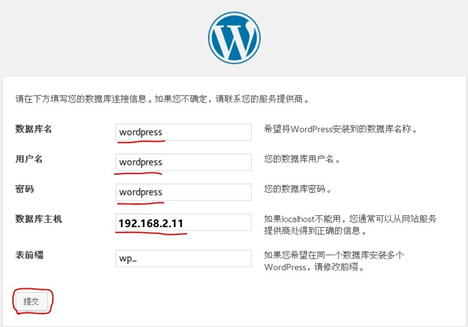

图-32

点击提交即可完成数据库的初始化工作，php动态脚本会自动在wordpress数据库中创建若干数据表，后期网站的数据都会写入对并的数据表中。效果如图-33所示。


图-33

第一次使用Wordpress需要给你的网站设置基本信息，如网站标题、网站管理员账户与密码等信息，配置完成后点击安装wordpress即可，如图-34所示。

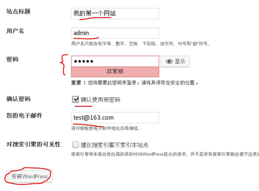

图-34

步骤三：网站后台管理

1）访问192.168.2.11服务器，进入并熟悉后台管理界面

通常情况下，开发人员会开发一个后台管理界面，当代码上线后，普通用户就可以管理和配置网站页面（需要使用网站的超级管理员身份才可以进入后台界面）。

```bash
客户端使用浏览器访问： firefox http://192.168.2.11				
```

访问首页后点击如图-35所示的登陆菜单，输入账户和密码进入后台管理界面。


图-35

或者直接在地址栏中输入后台管理界面的具体URL。

```bash
客户端使用浏览器访问： firefox  http://192.168.2.11/wp-login.php
```

输入管理员用户名和密码，效果如图-36所示。登陆后台管理界面效果如图-37所示。


图-36

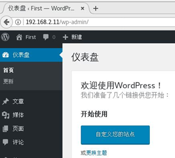

图-37

2）修改网站主题

Wordpress主题会影响网站的整体外观，我们可以使用默认自带的若干主题。

后台修改网站主题的菜单为<外观>--<主题>，使用默认主题，点击启用即可，如图-38所示。

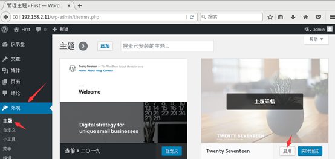

图-38

如果需要更多更新的主题，则可以去官网下载更多新的主题，默认下载的主题格式为zip压缩包。

官方网站主题链接：（https://cn.wordpress.org/themes/browse/popular/）。

将主题下载到服务器本地后，可以在后台管理界面添加主题，<外观>--<主题>--<添加>--<上传主题>--<浏览>--<现在安装>，如图-39所示。

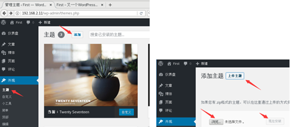

图-39

部署新主题的另一种方法是，直接将下载的zip主题包拷贝到wordpress代码的特定目录，如/usr/local/nginx/html/wp-content/themes/目录，然后使用unzip解压主题即可，效果如图-40所示。


图-40

3）修改网站小工具

小工具是首页中的各种常用功能菜单，可以添加和删除。

首先可以删除一些不需要的小工具，如最近文章、最近评论等，如图-41所示。

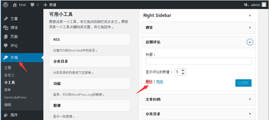

图-41

可以通过小工具为网站添加导航功能，使用鼠标将导航菜单拖动到合适的位置即可，默认没有导航菜单，需要自定义创建，如图-42所示。

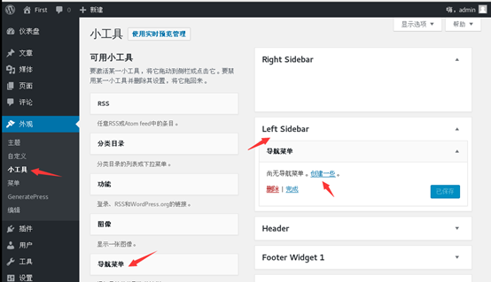

图-42

创建导航菜单后，可以继续创建页面，并将页面添加到导航菜单中。<页面>--<新建页面>即可添加新的页面，如图-43和图-44所示。新的页面内容可以是段落、图像、列表、引语等（每个人根据自己的需要自由发挥）。

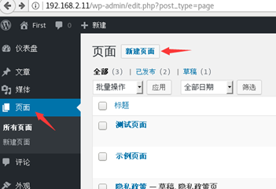

图-43

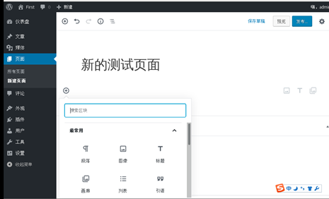

图-44

新的页面添加完成后，可以将其添加到菜单中使用，如图-45所示。访问网站首页即可查看导航菜单的效果，如图-46所示。

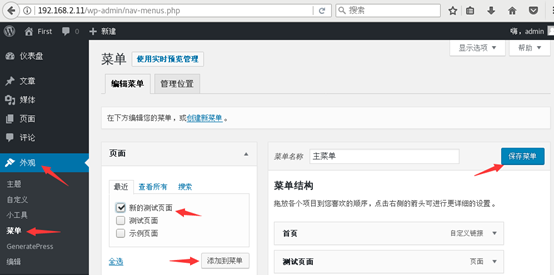

图-45

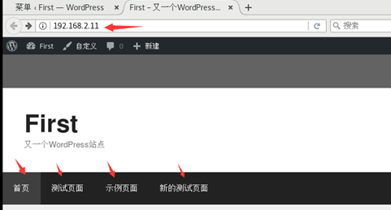

图-46

4）扩展其他问题

其他有关wordpress的使用方法与技巧，可以参考官方网站的文档资料，文档链接：https://codex.wordpress.org/zh-cn:Main_Page。

附加知识（常见面试题）

1）描述raid 0、1、5的特点和优点?

答：Raid0条带卷，可以高效读写，硬盘空间利用率100%，raid1是复制卷可以实现数据的高可靠读写，硬盘空间利率50%，raid5兼得以上两种优点，硬盘空间利用率N-1，仅可用损坏一块硬盘。

2）将目录/opt/bjca3打包备份排除/opt/bjca3/logs目录，传递到远程主机192.168.1.8的/backup目录下？

答：使用--exclude选项在打包时可用排除特定的目录，但是要注意，使用tar 的--exclude 排除打包的时候，不能加“/”，否则还是会把logs目录以及其下的文件打包进去。

错误写法：

tar -czvf bjca3.tar.gz --exclude=/opt/bjca3/logs/ /opt/bjca3

正确写法：

tar -czvf bjca3.tar.gz --exclude=/opt/bjca3/logs /opt/bjca3

3) 如何远程查看Linux服务192.168.1.7运行了多少时间？

答：ssh root@192.168.1.7 uptime

4）虚拟机常用有几种网络模式？请简述其工作原理或你个人的理解？

答：有桥接模式、隔离模式、NAT模式、路由模式，如图-47所示。


图-47

桥接模式：Guest与Host连接到同一个交换机上；通过桥接物理网卡，相当于直连到Host所在网络。（备注：Guest是虚拟机，Host是真实主机）

隔离模式：允许Guest访问同一虚拟交换机上的其他Guest；但是不能访问Host所在的外部网络。

NAT模式（默认）：将Guest虚拟机的默认网关指向Host物理机的虚拟网桥接口的IP地址；Guest共享真机的网络连接，以地址转换的方式访问外网。

路由模式：由Host物理机充当路由器，开启转发；需要额外设置外网与Guest虚拟机之间互访的路由条目，Guest以路由转发的方式访问外网（需要在真机配置iptables规则）。

5）在11月份内，每天的早上6点到12点中，每隔2小时执行一次 /usr/bin/httpd.sh，怎么实现？

答：

0 6-12/2 * 11 * /usr/bin/httpd.sh

6）如何查看当前系统是否有监听6666端口？

答：

netstat -untlp | grep 6666或者ss -nutlp | grep 6666

7) 如何显示CPU占用率最高的进程？

答：

top，输入大写的P

8）用什么命令可以查看上一次服务器启动时间、上一次谁登陆过服务器?

答：

last（历史登陆记录），uptime（系统累计运行的时间），who -b(上次启动系统的时间)