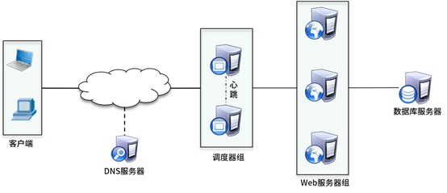
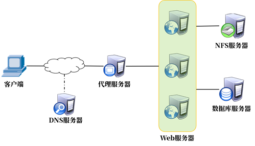
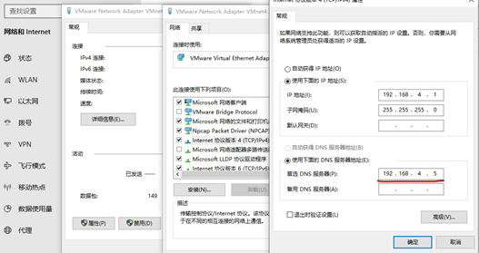

# NSD Project1 DAY02

[TOC]

## 1 案例1：网站架构演变

### 1.1 问题

学习从单机架构到集群架构的演变之路：

- 单机版LNMP
- 独立数据库服务器
- Web服务器集群与Session保持
- 动静分离、数据库集群
- 各种缓存服务器
- 业务模型

### 1.2 步骤

此案例主要是学习网站架构演变的过程，以拓扑图和理论为主，具体实现还需要结合具体的软件。

步骤一：单机版LNMP

单机版网站，拓扑如图-1所示。


图-1 单机版网站服务器

用户量少时使用，简单、成本低、存在单点故障。

步骤二：独立数据库服务器

独立数据库服务器是将网站静态文件、代码文件等资料与数据库分离的架构，当用户量增加时单机的处理能力有限，PHP或JAVA代码的执行需要消耗大量CPU资源，数据库的增删改查需要调用大量的内存资源，将两者分离可以减轻服务器的压力，其拓扑结构如图-2所示。


图-2 web服务器与数据库分离

Web服务器和数据库服务器的压力都可以得到有效改善，访问量有所增加。但是服务器依然存在单点故障问题。

步骤三：Web服务器集群与Session保持

我们可以通过Nginx、Haproxy代理服务器实现Web负载均衡集群，也可以使用LVS调度器实现Web负载均衡集群。部署完Web集群后还需要考虑如何进行Session会话保持，方法很多，如：根据源IP保持，代理服务器重写Cookie信息，共享文件系统保存session，使用数据库共享session等等。

该架构拓扑如图-3所示。


图-3

但是如果只有一台调度器依然会导致单点故障的问题，因此还需要使用Keepalived或Heartbeat之类的软件进行高可用配置，如图-4所示。



图-4

对于网站内容而言可以分离为动态页面和静态页面，静态页面就需要数据文件，动态页面则需要CPU解析代码，需要消耗大量的CPU资源，因此可以将静态和动态分离为两组服务器，动态页面有脚本代码组成，是一种基于网页的应用程序，因此这一组服务器也称为应用服务器，其架构如图-5所示。


图-5

步骤四：动静分离、数据库集群

随着服务器的增加，虽然性能与并发量得到了明显的提升，但是数据的一致性、管理的便利性成为了新的问题，因此就需要增加统一的存储服务器，实现数据的同步一致，可以使用NFS，GlusterFS、Ceph等软件实现该功能，其架构如图-6所示。


图-6

此时所有应用服务器都连接一台数据库服务器进行读写操作，而且后期随着数据库中的数据不断增加，会导致数据库成为整个网站的瓶颈！这就需要我们对数据进行分库分表，创建数据库主从或者数据库集群，实现读写分离，其拓扑如图-7所示。


图-7

步骤五：缓存服务器与业务模型

对于静态数据我们可以通过varnish、squid或者nginx进行缓存，将数据缓存到距离用户更近的位置，构建CDN（内容分发网络）架构。

对于传统的SQL数据库而言，我们也可以通过增加NoSQL数据库，实现数据缓存的功能，提升数据库的访问速度。

备注：数据库相关知识在第三阶段课程有详细介绍，第二阶段项目暂时不做数据库优化。

最后，基于前面的架构，我们还可以将网站按照公司的业务进行分离，每个业务都可以是一个独立的集群，如图-8所示。


图-8


## 2 案例2：LNP+Mariadb数据库分离

### 2.1 问题

部署LNP+Mariadb实现数据库与Web服务器分离，实现以下目标：

- 将旧的数据库备份，迁移到新的服务器
- 修改配置调用新的数据库服务器

### 2.2 方案

实验拓扑如图-9所示，做具体实验前请先配置好环境。


图-9

主机配置如表-1所示。

表-1


### 2.3 步骤

实现此案例需要按照如下步骤进行。

步骤一：部署数据库服务器

1）准备一台独立的服务器，安装数据库软件包

```bash
[root@database ~]# yum -y install mariadb mariadb-server mariadb-devel
[root@database ~]# systemctl start mariadb
[root@database ~]# systemctl enable mariadb
[root@database ~]# firewall-cmd --set-default-zone=trusted
[root@database ~]# setenforce  0
[root@database ~]# sed -i  '/SELINUX/s/enforcing/permissive/'  /etc/selinux/config
```

2)将之前单机版LNMP网站中的数据库迁移到新的数据库服务器。

登陆192.168.2.11主机，备份数据库并拷贝给新的服务器，关闭旧的数据库服务：

```bash
[root@centos7 ~]# mysqldump wordpress > wordpress.bak   
#备份数据库到文件（备份的文件名和扩展名任意）
[root@centos7 ~]# scp wordpress.bak 192.168.2.21:/root/    #拷贝备份文件到远程主机
[root@centos7 ~]# systemctl stop mariadb
[root@centos7 ~]# systemctl disable mariadb
```

登陆192.168.2.21主机，创建空数据库，使用备份文件还原数据库：

```bash
 [root@database ~]# mysql
 MariaDB [(none)]> create database wordpress character set utf8mb4;
 #创建数据库wordpress，该数据库支持中文
 MariaDB [(none)]> exit
```

使用备份文件还原数据：

```bash
[root@database ~]# mysql wordpress < wordpress.bak    
#使用备份文件导入数据到wordpress数据库
```

重新创建账户并授权访问：

```bash
[root@database ~]# mysql
MariaDB [(none)]> grant all on wordpress.* to wordpress@'%' identified by 'wordpress';
#语法格式：grant 权限 on 数据库名.表名  to 用户名@客户端主机 identified by 密码
#创建用户并授权，用户名为wordpress，该用户对wordpress数据库下的所有表有所有权限
#wordpress用户的密码是wordpress，授权该用户可以从localhost主机登录数据库服务器
#all代表所有权限（wordpress用户可以对wordpress数据库中所有表有所有权限）
#wordpress.*代表wordpress数据库中的所有表
MariaDB [(none)]> flush privileges;
#刷新权限
MariaDB [(none)]> exit
```

\#备注：在MySQL和MariaDB中%代表所有，这里是授权任何主机都可以连接数据库。

3）修改wordpress网站配置文件，调用新的数据库服务器。

Wordpress在第一次初始化操作时会自动生产配置文件：wp-config.php，登陆192.168.2.11修改该文件即可调用新的数据库服务。

```bash
[root@centos7 ~]# vim /usr/local/nginx/html/wp-config.php
修改前内容如下：
define('DB_HOST', '192.168.2.11');
修改后内容如下：
define('DB_HOST', '192.168.2.21');
```

步骤二：客户端测试

1）客户端使用浏览器访问wordpress网站。

```bash
客户端浏览器访问   firefox http://192.168.2.11
```


## 3 案例3：Web服务器集群

### 3.1 问题

使用HAProxy部署Web服务器集群，实现以下目标：

- 部署三台Web服务器
- 迁移网站数据，使用NFS实现数据共享
- 部署HAProxy代理服务器实现负载均衡
- 部署DNS域名解析服务器

### 3.2 方案

实验拓扑如图-10所示，做具体实验前请先配置好环境。



图-10

备注：实际操作中DNS服务代理服务器部署在同一台主机上（节约虚拟机资源）。

主机配置如表-2所示。

表-2


### 3.3 步骤

实现此案例需要按照如下步骤进行。

步骤一：部署web2和web3服务器

1）安装LNP软件包

```bash
[root@web2 ~]# yum -y install gcc pcre-devel openssl-devel
[root@web2 lnmp_soft]# tar -xf nginx-1.12.2.tar.gz
[root@web2 lnmp_soft]# cd nginx-1.12.2/
[root@web2 nginx-1.12.2]# ./configure --with-http_ssl_module  --with-http_stub_status_module
[root@web2 nginx-1.12.2]# make && make install
[root@web2 ~]# yum -y install php php-fpm php-mysql mariadb-devel

[root@web3 ~]# yum -y install gcc pcre-devel openssl-devel 
[root@web3 lnmp_soft]# tar -xf nginx-1.12.2.tar.gz
[root@web3 lnmp_soft]# cd nginx-1.12.2/
[root@web3 nginx-1.12.2]# ./configure --with-http_ssl_module --with-http_stub_status_module
[root@web3 nginx-1.12.2]# make && make install
[root@web3 ~]# yum -y install php php-fpm php-mysql mariadb-devel
```

2）修改nginx配置实现动静分离（web2和web3操作）

web2修改默认首页index.php，配置两个location实现动静分离。

```bash
[root@web2 ~]# vim /usr/local/nginx/conf/nginx.conf
location / { 
			root   html;        
            index  index.php index.html index.htm;     
           }
location ~ \.php$ {   
			root            html;        
            fastcgi_pass   127.0.0.1:9000;       
            fastcgi_index  index.php;         
            include         fastcgi.conf;    
            }
```

web3修改默认首页index.php，配置两个location实现动静分离。

```bash
[root@web3 ~]# vim /usr/local/nginx/conf/nginx.conf
location / {           
			root   html;           
			index  index.php index.html index.htm;    
			}
location ~ \.php$ {       
			root            html;      
			fastcgi_pass   127.0.0.1:9000;      
			fastcgi_index  index.php;       
			include         fastcgi.conf;   
			}
```

3）启动相关服务、设置防火墙和SELinux

```bash
[root@web2 ~]# echo "/usr/local/nginx/sbin/nginx" >> /etc/rc.local
[root@web2 ~]# chmod +x /etc/rc.local
[root@web2 ~]# /usr/local/nginx/sbin/nginx
[root@web2 ~]# systemctl start  php-fpm                   #启动php-fpm服务
[root@web2 ~]# systemctl enable php-fpm                   #设置服务开启自启
[root@web2 ~]# firewall-cmd --set-default-zone=trusted
[root@web2 ~]# setenforce  0
[root@web2 ~]# sed -i  '/SELINUX/s/enforcing/permissive/'  /etc/selinux/config

[root@web3 ~]# echo "/usr/local/nginx/sbin/nginx" >> /etc/rc.local
[root@web3 ~]# chmod +x /etc/rc.local
[root@web3 ~]# /usr/local/nginx/sbin/nginx
[root@web3 ~]# systemctl start  php-fpm                   #启动php-fpm服务
[root@web3 ~]# systemctl enable php-fpm                #设置服务开机自启
[root@web3 ~]# firewall-cmd --set-default-zone=trusted
[root@web3 ~]# setenforce  0
[root@web3 ~]# sed -i  '/SELINUX/s/enforcing/permissive/'  /etc/selinux/config
```

附加知识：systemd！！！

源码安装的软件默认无法使用systemd管理，如果需要使用systemd管理源码安装的软件需要手动编写服务的service文件（编写是可以参考其他服务的模板文件）。以下是nginx服务最终编辑好的模板。

Service文件存储路径为/usr/lib/systemd/system/目录。

```bash
[root@centos7 ~]# vim /usr/lib/systemd/system/nginx.service
[Unit]
Description=The Nginx HTTP Server
#描述信息
After=network.target remote-fs.target nss-lookup.targe
t#指定启动nginx之前需要其他的其他服务，如network.target等

[Service]
Type=forking
#Type为服务的类型，仅启动一个主进程的服务为simple，需要启动若干子进程的服务为forking
ExecStart=/usr/local/nginx/sbin/nginx
#设置执行systemctl start nginx后需要启动的具体命令.
ExecReload=/usr/local/nginx/sbin/nginx -s reload
#设置执行systemctl reload nginx后需要执行的具体命令.
ExecStop=/bin/kill -s QUIT ${MAINPID}
#设置执行systemctl stop nginx后需要执行的具体命令.

[Install]
WantedBy=multi-user.target
```

步骤二：部署NFS，将网站数据迁移至NFS共享服务器

1）部署NFS共享服务器

```bash
[root@nfs ~]# yum install nfs-utils
[root@nfs ~]# mkdir /web_share
[root@nfs ~]# vim /etc/exports/web_share  192.168.2.0/24(rw,no_root_squash)
[root@nfs ~]# systemctl restart rpcbind
[root@nfs ~]# systemctl enable rpcbind
```

no_root_squash参数可以在网络上搜索扩展下自己的知识。

NFS使用的是随机端口，每次启动NFS都需要将自己的随机端口注册到rpcbind服务，这样客户端访问NFS时先到rpcbind查询端口信息，得到端口信息后再访问NFS服务。

```bash
[root@nfs ~]# systemctl restart nfs
[root@nfs ~]# systemctl enable nfs
[root@nfs ~]# firewall-cmd --set-default-zone=trusted
[root@nfs ~]# setenforce  0
[root@nfs ~]# sed -i  '/SELINUX/s/enforcing/permissive/'  /etc/selinux/config
```

2）迁移旧的网站数据到NFS共享服务器

将web1（192.168.2.11）上的wordpress代码拷贝到NFS共享。

```bash
[root@web1 ~]# cd /usr/local/nginx/
[root@web1 nginx]# tar -czpf html.tar.gz html/
#-p代表打包时保留文件的权限
[root@web1 nginx]# scp html.tar.gz 192.168.2.31:/web_share/
```

登陆nfs服务器，将压缩包解压

```bash
[root@nfs ~]# cd /web_share/
[root@nfs web_share]# tar -xf html.tar.gz
```

3)所有web服务器访问挂载NFS共享数据。

```bash
[root@web1 ~]# rm -rf /usr/local/nginx/html/*
[root@web1 ~]# yum -y install nfs-utils
[root@web1 ~]# echo "192.168.2.31:/web_share/html /usr/local/nginx/html/ nfs defaults 0 0" >> /etc/fstab
[root@web1 ~]# mount -a

[root@web2 ~]# yum -y install nfs-utils
[root@web2 ~]# echo "192.168.2.31:/web_share/html /usr/local/nginx/html/ nfs defaults 0 0" >> /etc/fstab
[root@web2 ~]# mount -a

[root@web3 ~]# yum -y install nfs-utils
[root@web3 ~]# echo "192.168.2.31:/web_share/html /usr/local/nginx/html/ nfs defaults 0 0" >> /etc/fstab
[root@web3 ~]# mount -a
```

步骤三：部署HAProxy代理服务器

1）部署HAProxy

安装软件，手动修改配置文件，添加如下内容。

```bash
[root@proxy ~]# yum -y install haproxy 
[root@proxy ~]# vim /etc/haproxy/haproxy.cfglisten wordpress *:80        #监听80端口  
	balance roundrobin         #轮询算法  
	server web1 192.168.2.11:80 check inter 2000 rise 2 fall 3  
	server web2 192.168.2.12:80 check inter 2000 rise 2 fall 3 
    server web3 192.168.2.13:80 check inter 2000 rise 2 fall 3

[root@proxy ~]# systemctl start haproxy
[root@proxy ~]# systemctl enable haproxy
[root@proxy ~]# firewall-cmd --set-default-zone=trusted
[root@proxy ~]# setenforce  0
[root@proxy ~]# sed -i  '/SELINUX/s/enforcing/permissive/'  /etc/selinux/config
```

步骤三：部署DNS域名服务器

1）安装DNS相关软件（192.168.4.5操作）。

```bash
 [root@proxy ~]# yum -y  install bind bind-chroot
```

2）修改主配置文件，添加zone。

```bash
[root@proxy ~]# vim /etc/named.conf
	options {     
	listen-on port 53 { any; };           #服务监听的地址与端口   
	directory       "/var/named";         #数据文件路径       
	allow-query     { any; };             #允许任何主机访问DNS服务
... ...
};

zone "lab.com" IN {                        #定义正向区域    
	type master;      
	file "lab.com.zone";
};

#include "/etc/named.rfc1912.zones";    #注释掉该行
#include "/etc/named.root.key";         #注释掉该行

[root@proxy ~]# named-checkconf /etc/named.conf            #检查语法
```

3）修改正向解析记录文件。

注意：保留文件权限（相关配置文件知识参考第一阶段课程）。

```bash
[root@proxy named]# cp -p /var/named/named.localhost /var/named/lab.com.zone
[root@proxy named]# vim /var/named/lab.com.zone
$TTL 1D
@    IN SOA  @ rname.invalid. (                             
					0       ; serial                                  
					1D      ; refresh                             
					1H      ; retry                               
					1W      ; expire                               
					3H )    ; minimum
@        NS     dns.lab.com.
dns     A       192.168.4.5
www     A       192.168.4.5
```

4）启动服务

```bash
[root@proxy named]# systemctl start named
[root@proxy named]# systemctl enable named
[root@proxy ~]# firewall-cmd --set-default-zone=trusted
[root@proxy ~]# setenforce  0
[root@proxy ~]# sed -i  '/SELINUX/s/enforcing/permissive/'  /etc/selinux/config
```

5）客户端修改DNS

如果客户端是Linux主机，则客户端修改DNS解析文件

提示：做完实验修改回原始内容。

```bash
[root@room9pc01 data]# cat /etc/resolv.conf
# Generated by NetworkManager
search tedu.cn
nameserver 192.168.4.5
nameserver 172.40.1.10
nameserver 192.168.0.220
```

如何客户端是Windows则需要在图形中配置网卡的DNS服务器。如图-11所示。



图-11

备注：

如果不做DNS，也可以直接修改hosts解析文件。

如果是Linux客户端，则修改/etc/hosts文件。

如果是Windows客户端，则需要以管理员身份启动记事本修改C:\Windows\System32\drivers\etc\hosts文件。

步骤四：修改wordpress配置文件

1）修改wp-config.php

在define('DB_NAME', 'wordpress')这行前面添加如下两行内容：

```bash
[root@web3 html]# vim /usr/local/nginx/html/wp-config.php
define('WP_SITEURL', 'http://www.lab.com');
define('WP_HOME', 'http://www.lab.com');
```

如果不添加这两行配置，浏览器访问网站某个子页面后，URL会固定到某一台后端服务器不轮询。

警告：添加的这两行必须与前面的域名解析一致！！！！

附加知识（常见面试题）

1) 什么是灰度发布：

答：

灰度发布（又名金丝雀发布）是指在黑与白之间，能够平滑过渡的一种发布方式。

让一部分用户继续用产品特性A，一部分用户开始用产品特性B，如果用户对B没有什么反对意见，那么逐步扩大范围，把所有用户都迁移到B上面来。灰度发布可以保证整体系统的稳定，在初始灰度的时候就可以发现、调整问题，以保证其影响度。灰度期：灰度发布开始到结束期间的这一段时间，称为灰度期。

2）DNS服务器有哪些种，其使用的端口为多少？

答：

有 根DNS、一级DNS、二级DNS、三级DNS、缓存DNS

主DNS服务器、从DNS服务器

端口：53

3）从日志/opt/bjca3/logs/ca_access.log中截取14点到16点的日志，将截取的日志导入到/tmp/ca_access.txt中，日志格式如下：

```bash
[Fri Mar 17 13:59:00 2017] [debug] mod_cmp.c(1600):[client 192.168.97.8] [CMP] CMP_set_status: starting …[Fri Mar 17 13:59:00 2017] [debug] mod_cmp.c(938):[client 192.168.97.8] [CMP] CMP_cu_integer_set: starting …[Fri Mar 17 13:59:00 2017] [debug] mod_cmp.c(957):[client 192.168.97.8] [CMP] CMP_cu_integer_set: ending ok …………
[Fri Mar 17 16:36:00 2017] [debug] mod_cmp.c(1014):[client 192.168.97.8] [CMP] cu_octet_str_set: starting …[Fri Mar 17 16:36:00 2017] [debug] mod_cmp.c(1037):[client 192.168.97.8] [CMP] cu_octet_str_set: ending ok …
```

答：

awk '$4>="14:00:00"&&$4<="16:59:00"' ca_access.log

4）监控检查，使用ping命令编写脚本来查询一组IP地址同时检测他们是否处于活跃状态。要求（range：192.168.1.200-192.168.1.220，一个IP发送4个ping包，ping的过程不能输出信息到终端）？

答：

```bash
#!/bin/bash
for i in {200..220}
do
	ping -c 4  -i 0.2  -W 1  192.168.1.$i &>/dev/null
	if  [  $? -ne 0 ];then   
    	echo  "192.168.1.$i is down" >> log.txt
    fi
done
```

5）假设nginx的访问日志格式如下，统计访问页面前10位的IP数？

```bash
202.101.129.218 - - [26/Mar/2017:23:59:55 +0800] "GET /online/stat_inst.php?
pid=d065HTTP/1.1" 302 20 -"-" "-" "Mozilla/4.0(compatible;MSIE 6.0;Windows NT 5.1)"
```

答：

```awk '{IP[$1]++} END{for(i in IP){print i,IP[i]}}' access.log  |  sort -n  |  tail -10```

6) 请列举出10个以上的你所知晓的SQL语句？

参考答案：

```bash
insert  select   delete  update  create  show   drop   grant    revoke   load data   create view
```

7）如何切换到某个数据库，并在上面工作？

答：

use 库名;

8）列出数据库内的所有表？

答：

show tables;

9）如何删除表、删除数据库？

答：

drop table 表名;drop database 库名;

10）如何列出表"xrt"内name域值为"tecmint"，web_address域值为"tecmint.com"的所有数据？

答：

```
select  *  from  xrt  where  name="tecmint" and  web_address="tecmint.com";
```