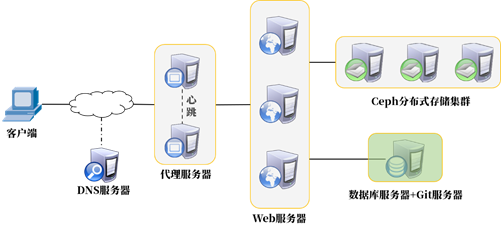

# NSD Project1 DAY04

[TOC]

## 1 案例1：部署Git版本控制系统

### 1.1 问题

部署Git版本控制系统，管理网站代码，实现如下效果：

- 基于SSH协议的服务器
- 基于Git协议的服务器
- 基于HTTP协议的服务器
- 上传代码到版本仓库

### 1.2 方案

生产环境应该有一台独立的Git服务器，这里为了节约主机资源，我们使用数据库主机同时做完Git服务器，如图-1所示。



图-1

主机配置如表-1所示。

表-1


### 1.3 步骤

实现此案例需要按照如下步骤进行。

步骤一：部署SSH协议的版本控制服务器

1）安装软件包，创建空仓库。

```bash
[root@database ~]# yum -y install git
[root@database ~]# mkdir /var/lib/git/
[root@database ~]# git init --bare /var/lib/git/wordpress.git        #创建空仓库
```

2）登陆web1服务器克隆git仓库，上传网站代码到git服务器。

```bash
[root@web1 var]# git config --global push.default simple
[root@web1 var]# git config --global user.email you@example.com
[root@web1 var]# git config --global user.name "Your Name"

[root@web1 var]# cd /var/
[root@web1 var]# git clone root@192.168.2.21:/var/lib/git/wordpress.git
[root@web1 var]# cd /var/wordpress
[root@web1 wordpress]# cp -a /usr/local/nginx/html/*  ./

[root@web1 wordpress]# git add .
[root@web1 wordpress]# git commit -m "wordpress code"
[root@web1 wordpress]# git push
root@192.168.2.21's password:<输入192.168.2.21主机root的密码>
```

步骤二：部署Git协议的版本控制服务器

1）安装软件包（192.168.2.21操作）

```bash
[root@database ~]# yum -y install git-daemon
```

2）修改配置文件，启动Git服务

```bash
[root@database ~]# cat /usr/lib/systemd/system/git@.service
#仅查看即可
[root@database ~]# systemctl start git.socket
[root@database ~]# systemctl status git.socket
```

3)客户端测试（使用web2做完客户端主机，192.168.2.12）

在web2执行clone等同于是把代码又备份了一份。

```bash
[root@web2 ~]# cd /var/
[root@web2 var]# git clone git://192.168.2.21/wordpress.git
```

步骤三：部署HTTP协议的版本控制服务器

1）安装软件包（192.168.2.21操作）

```bash
[root@database ~]# yum -y install httpd gitweb
```

2）修改配置文件

```bash
[root@database ~]# vim /etc/gitweb.conf
$projectroot = "/var/lib/git";                        #添加一行
```

3）启动服务

```bash
[root@database ~]# systemctl start httpd
```

4）客户端验证

```bash
火狐浏览器访问 firefox http://192.168.2.21/git
```

访问网页可以查看到wordpress仓库，点击tree菜单后可以看到如图-2所示的代码。


图-2


## 2 案例2：优化Web服务器

### 2.1 问题

优化Web服务器，实现如下效果：

- 自定义网站404错误页面
- 升级nginx至1.15.8版本，开启status模块
- 编写日志切割脚本，实现每周五备份日志
- 开启gzip压缩功能，提高数据传输效率
- 开启文件缓存功能

### 2.2 步骤

实现此案例需要按照如下步骤进行。

步骤一：自定义404错误页面

1）优化前测试（客户端访问一个不存在的页面）。

```bash
客户端浏览器访问： firefox http://www.lab.com/git
```

2) 修改Nginx配置文件，自定义错误页面

```bash
[root@web1 ~]# vim /usr/local/nginx/conf/nginx.conf     
error_page   404  /404.html;    //自定义错误页面

[root@web2 ~]# vim /usr/local/nginx/conf/nginx.conf    
error_page   404  /404.html;    //自定义错误页面

[root@web3 ~]# vim /usr/local/nginx/conf/nginx.conf      
error_page   404  /404.html;    //自定义错误页面
```

3） 重启nginx

```bash
[root@web1 ~]# /usr/local/nginx/sbin/nginx -s reload
[root@web2 ~]# /usr/local/nginx/sbin/nginx -s reload
[root@web3 ~]# /usr/local/nginx/sbin/nginx -s reload
```

步骤二：升级nginx版本，开启status模块

1）配置、编译新的nginx（web1、web2、web3做相同操作，下面以web1为例）

```bash
[root@web1 ~]# tar  -xf   nginx-1.15.8.tar.gz
[root@web1 ~]# cd  nginx-1.15.8
[root@web1 nginx-1.15.8]# ./configure   --with-http_ssl_module  --with-http_stub_status_module
[root@web1 nginx-1.15.8]# make
```

2) 备份老版本nginx，更新新版本nginx

```bash
[root@web1 nginx-1.15.8]# mv /usr/local/nginx/sbin/nginx{,.old}
[root@web1 nginx-1.15.8]# cp objs/nginx  /usr/local/nginx/sbin/
```

3）修改配置文件

```bash
[root@web1 ~]# vim /usr/local/nginx/conf/nginx.conf
... ...
location /status {      
				stub_status on;                
               			 allow 192.168.2.0/24;          #允许哪个网段查看状态页面         
               			 deny all;                       #拒绝谁访问查看状态页面     
               }
... ...
```

4) 升级或重启服务

注意：必须在nginx-1.15.8源码包目录下执行make upgrade命令。

```bash
[root@web1 nginx-1.15.8]# make upgrade
```

或者手动执行killall命令杀死进程后重新启动，没有killall命令则需要安装psmisc软件包。

```bash
[root@web1 ~]# killall nginx
[root@web1 ~]# /usr/local/nginx/sbin/nginx
```

步骤三：编写日志切割脚本

1）编写脚本（以web1为例）

```bash
[root@web1 ~]# vim /usr/local/nginx/logbak.sh
#!/bin/bash
date=`date +%Y%m%d`
logpath=/usr/local/nginx/logs
mv $logpath/access.log $logpath/access-$date.log
mv $logpath/error.log $logpath/error-$date.log
kill -USR1 $(cat $logpath/nginx.pid)
```

2）创建计划任务

```bash
[root@web1 ~]# crontab -e
03 03 * * 5  /usr/local/nginx/logbak.sh
```

步骤四：对页面进行压缩处理

1）修改Nginx配置文件

```bash
[root@web1 ~]# cat /usr/local/nginx/conf/nginx.conf
http {
.. ..
gzip on;                            //开启压缩
gzip_min_length 1000;                //小文件不压缩
gzip_comp_level 4;                //压缩比率
gzip_types text/plain text/css application/json application/x-javascript text/xml application/xml application/xml+rss text/javascript;                                    //对特定文件压缩，类型参考mime.types.. ..
}
```

步骤五：服务器内存缓存

1）如果需要处理大量静态文件，可以将文件缓存在内存，下次访问会更快。

```bash
http {
open_file_cache          max=2000  inactive=20s;    
		open_file_cache_valid    60s;     
        open_file_cache_min_uses 5;      
        open_file_cache_errors   off;
//设置服务器最大缓存2000个文件句柄，关闭20秒内无请求的文件句柄
//文件句柄的有效时间是60秒，60秒后过期
//只有访问次数超过5次会被缓存
} 
```

附加知识（常见面试题）

1）Git的主要功能是什么。它的常用命令有哪些？

答：

Git是一个分布式的版本控制软件，支持离线操作，主要功能为版本控制，支持日志、数据恢复等功能。

主要命令：

git clone、git add、git commit、git log、git branch、git checkout、git pull、git merge等。

2）工作中你都写过什么脚本？

答：

监控脚本（监控系统、监控服务、监控硬件信息、监控性能、安全监控等）

系统初始化脚本（创建目录，创建账户，安装软件包，设置权限，修改内核参数等）

一键部署（源码安装脚本）

备份脚本（自动备份数据库，备份网站数据，备份日志，备份配置文件等）

日志分析脚本（分析日志数据，汇总并统计相关信息，如PV、UV等）

3）Nginx你用到哪些模块,在proxy模块中你配置哪些参数？

答：

ngx_http_core_module（核心模块，包含http、server_name、root等配置参数）

ngx_http_access_module（访问控制模块，包含allow和deny配置参数）

ngx_http_auth_basic_module（用户认证模块，包含auth_basic等配置参数）

ngx_http_charset_module（字符集模块，包含charset utf8等配置参数）

ngx_http_fastcgi_module（fastcgi模块，包含fastcgi_pass等配置参数）

ngx_http_gzip_module（压缩模块，包含gzip、gzip_type等配置参数）

ngx_http_limit_conn_module（限制并发量模块，包含limit_conn等参数）

ngx_http_log_module（日志模块，包含access_log等配置参数）

ngx_http_proxy_module（代理模块，包含proxy_pass等配置参数）

ngx_http_rewrite_module（地址重写模块，包含rewrite、break、last等配置参数）

ngx_http_ssl_module（加密模块，包含ssl_certificate、ssl_certificate_key等参数）

ngx_http_stub_status_module（状态模块，包含stub_status配置参数）

ngx_http_upstream_module(调度器模块，包含upstream、hash、ip_hash等配置参数)

ngx_stream_core_module（4层代理模块）

在proxy模块中有proxy_pass、proxy_cache、proxy_cache_path、proxy_connect_timeout、proxy_limit_rate等参数）

4）HTTP常见状态码有哪些，分别是什么含义？

答案参考前面的运维课程

5）linux系统中你会用什么命令查看硬件使用的状态信息?

答：

uptime、lscpu查看CPU

free查看内存

lsblk、df、iostat查看磁盘

ifconfig、ip a s查看网卡

dmidecode查看主板设备信息

6）如果你用 grep -i "error" 过滤只是包含error的行，想同时过滤error上面和下面的行如何实现？

答：

grep -i "error" 文件 -A 后面的行数 -B 前面的行数

grep -i "error" 文件 -C 前后的行数